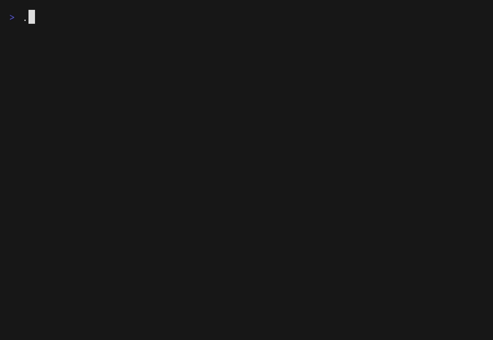

# goinfer



*An entire 1.5B LLM in one file — instant boot (~0.4s), <100 MB heap, runs offline. Writes correct generic Go and **cannot** emit invalid JSON. No cgo, no Python, no model download.*

**Run open-weight LLMs in pure Go — one cgo-free static binary, portable by default and
native-GPU-fast when you want it.** ~20 model architectures, HuggingFace-parity-gated, with
schema-constrained structured output. No Python, no llama.cpp, no CUDA toolkit.

goinfer is a pure-Go, no-cgo decoder-only LLM runtime that loads open-weight checkpoints
and runs them **in-process**. What makes it different — you don't have to choose:

- **One cgo-free static binary.** Pure Go, no cgo → cross-compiles to a single file
  (macOS / Linux / Windows, Intel + ARM). No Python, no llama.cpp `.so`, no CUDA toolkit,
  no provider API. The runtime *and*, if you want, the model in one file you `scp` and run
  offline.
- **Fast when you want it — still cgo-free.** The default build is pure-Go CPU
  (SIMD-accelerated, NEON / AVX2). Opt into a GPU backend and it *stays* `CGO_ENABLED=0`:
  **native CUDA** (cgo-free, driver-only — no toolkit; **14.6 MB** of binary against a bundled
  toolkit's gigabytes, decoding qwen2.5-coder-1.5B at **217.8 tok/s** at short context — measured
  numbers and the peer comparison below), **native Metal** on Apple Silicon,
  and a portable **WebGPU** backend (~60–70% of native, but runs on *any* GPU and streams
  bigger-than-VRAM MoE weights). Going fast never costs you the single binary.
- **~20 architectures, one binary.** All four attention / sequence-mixing families —
  softmax·GQA, gated-linear (DeltaNet), state-space (Mamba-2), latent-KV (MLA) — plus dense
  and sparse-MoE, across ~20 architectures (Gemma 3/4, Qwen 2.5/3, Llama, Mistral, Mixtral,
  Qwen-MoE, GLM-4.5/4.6, DeepSeek-V2/V3 + Kimi, Phi-3/4, Granite-4.0-H, Nemotron-H, GPT-2,
  Mellum2). From safetensors, GGUF, GPTQ, or AWQ; f32 / bf16 / f16 + int8 / int4.
- **Parity-gated against the reference implementation.** Every forward pass is parity-gated
  against the HuggingFace reference (argmax-exact + logit cosine). A shared feature taxonomy
  means a backend declares a feature only when it ships the kernel — so an architecture it
  can't fully run is declined at load and served on the CPU path, rather than run with a
  feature quietly dropped. And constrained decoding masks the logits so structured output
  always fits your JSON schema (below).

### What it's for — and what it isn't

goinfer targets **single-user local inference**: one process, one machine, batch-1 decode,
deployed by copying a file. That is the axis it optimizes — `go build` with **no toolchain of
any kind** (no CUDA toolkit, no C++ compiler, no CMake, no Python), cross-compiling like any
other Go program, and every GPU fast path is gated bit-identical against its own reference path,
with all backends parity-gated against the pure-Go CPU implementation — which is itself
parity-gated against HuggingFace. Bit-identity is a **within-machine, within-OS** property: the
Metal backend compiles its MSL at runtime with the OS's own shader toolchain, so identity holds
for a given machine and OS version, not between them. The parity *gates* are what is portable;
the bytes are not.

It is **not a serving engine.** There is no continuous batching and no paged attention: a
model serves one generation at a time behind a bounded queue. If your problem is saturating a
datacentre GPU with concurrent requests, vLLM and its ports are built for that and goinfer is
not.

It is also not a provider-orchestration library (e.g. `teilomillet/gollm`) that calls remote
LLM APIs. goinfer runs the weights itself, locally, in-process.

Built on [`aikit`](https://github.com/townsendmerino/aikit)'s embedding and tensor
primitives.

Full, generated support map (every supported `model_type`, how each family is
configured — coverage axis, MoE, RoPE, norm, loaders, modality):
[docs/capability-matrix.md](docs/capability-matrix.md) (generated from the
registry; do not hand-edit).

The Go bindings for llama.cpp still ship a native library alongside the binary, and the
pure-Go ports I know of are no longer maintained. goinfer aims to be a pure-Go option you can
actually deploy. Measured numbers, every cell with provenance:
[docs/benchmarks.md](docs/benchmarks.md).


*Bigger than your VRAM: JetBrains **Mellum2** — a 12B sparse-MoE coding model — decoding
**GPU-resident on a consumer 8 GB card**. The int4 experts stream into VRAM through a
pure-Go WebGPU backend (no CUDA, no Python, no llama.cpp); a 12B that won't fit 8 GB at
int8 runs **fully resident** at int4, ~13–21 tok/s. It writes idiomatic Go. Prequant the
weights once to a `.giw` bundle and it reloads in ~13 s
([docs/mellum2-resident.md](docs/mellum2-resident.md)).*

*And bigger still — **Gemma 4 26B-A4B** (a 26B MoE whose ~11.4 GB of int4 experts **do not
fit 8 GB even at 4-bit**) decodes coherently on the same card, running **fully GPU-resident** —
every expert executes on the GPU, streamed from host RAM into a VRAM cache over the cgo-free CUDA
backend. Rate depends on how much of that cache fits: **11.3 tok/s at 16 slots/layer**, and
**16.98 tok/s** was measured once at 38 — a configuration not currently reproducible on this card
(see the note below, and read the slot count as part of the claim).
(Current Ollama also runs this 26B on 8 GB, but by offloading 58% to the CPU, at ~24.5 tok/s;
goinfer's distinction is all-experts-on-GPU, not that peers can't run it —
[docs/task-moe-streaming.md](docs/task-moe-streaming.md).)*

> **Running a model larger than your card is opt-in.** Gemma-4 residency is on by default, but
> host→VRAM expert streaming is not — without it the 26B's experts must fit VRAM, and on an 8 GB
> card they do not, so the runtime declines to CPU (and says so). Reproducing the number above
> needs two environment variables:
>
> ```bash
> cd cuda && CGO_ENABLED=0 \
>   GOINFER_MOE_CACHE_EXPERTS=1 \ # stream routed experts host→VRAM (they exceed 8 GB)
>   GOINFER_MOE_CACHE_SLOTS=128 \ # per-layer cache depth. NOT optional: the default is the
>                                 # minimum that works and re-fetches every expert every token.
>                                 # Set it high — the runtime caps it to what fits (33 here).
>   go run -tags cuda ./cmd/serve --backend cuda --quant int4 \
>     --model ~/models/gemma-4-26b-a4b-it
> ```
>
> **Sizing it.** A slot count is only safe *relative to free VRAM*, so there is no universally
> correct number: a display attached, another process resident, or a longer `--ctx` all leave you
> less than a bare card. **You do not have to pick one.** The runtime measures free VRAM and caps
> the slot count, so setting it high (or leaving it at 128, "all experts") gets you the largest cache
> that actually fits — on an 8 GB card with nothing else on the GPU that is 33, and it is chosen for
> you.
>
> **If you are on an older build, this section used to say the cap could not be trusted.** That was
> accurate. Between v0.11.0 and the fix, the cap summed requested bytes while the CUDA driver charges
> each allocation whole 2 MiB quanta, so on an 8 GB card it granted 34 slots — a value that allocates
> successfully and then cannot launch, giving `CUDA_ERROR_OUT_OF_MEMORY` at the first forward and
> zero tokens. The recommended workaround was to set the count manually to 30.
>
> The cap now accounts for both costs it was missing:
>
> - **allocation granularity** — four buffers per MoE layer, each rounded up to its own 2 MiB quantum,
>   so the requirement is a step function of the slot count and is searched rather than divided. At 34
>   slots all four buffers tip a quantum at once, putting the requirement 203,816,960 B over free.
> - **the deferred first-launch reservation** — the on-GPU router kernel declares per-thread scratch,
>   and the driver backs it for the device's occupancy the first time that kernel runs. Measured on an
>   RTX 2070 SUPER: it *demands* 289,013,760 B at that launch and *retains* 138,412,032 B, and none of
>   it is visible to the free-VRAM reading the cap is computed from.
>
> **How to tell whether your build has the fix:** the cap logs the value it chose
> (`C′ cache: … capping to N`). On an 8 GB card with a bare GPU, **33 has the fix and 34 does not**.
> If you still see `CUDA_ERROR_OUT_OF_MEMORY` at the first forward, the launch error now names the
> kernel and both the requested and effective slot counts; lower `GOINFER_MOE_CACHE_SLOTS` below the
> effective value.
>
> What the slot count buys, measured on this card — the flag is not a tuning knob, it is the
> difference between the feature working and not:
>
> | slots/layer | LRU hit rate | decode | note |
> |---|---|---|---|
> | 8 (default) | **0%** | ~5 tok/s | `top_k` is 8, so each token's routed set exactly fills the cache and nothing survives to the next — the cache is **inert** |
> | 16 | 57.3% | 11.33 tok/s | eviction cycling normally |
> | 30 | *not yet measured* | *not yet measured* | highest value confirmed to run here |
> | 38 | 81.6% | **16.98 tok/s** | the published figure — see below |
>
> **About the 16.98 tok/s quoted above.** It was measured, on this card, at 38 slots. It is not
> currently reproducible here: that run had materially more free VRAM than the gates now see, and
> at the free VRAM these tests observe the cap lands at 34, which fails. The number was real and
> the configuration was narrow — it ran with roughly the forward's own demand left over. Treat it
> as the ceiling this approach reached on one occasion, not as a target to configure toward.

## Try it: an LLM in one file

[`demo/chat`](demo/chat) is a local coding assistant that's a **single static
binary** — the runtime *and* the model in one file. Download it, run it, chat
offline: no install, no Python, no cgo, no model download.

Grab a binary from the [latest release](https://github.com/townsendmerino/goinfer/releases/latest)
(macOS / Linux / Windows, Intel + ARM), or run from source against your own GGUF:

```bash
go run ./demo/chat --model ~/models/qwen2.5-coder-0.5b-instruct-q4_k_m.gguf
```

### Run Gemma 4 (pure Go, no cgo)

goinfer runs Google's **Gemma 4** end to end in pure Go — including the
**E-models** (E2B/E4B) with their Per-Layer-Embedding stack, and the **12B
dense**. Grab the QAT GGUF and point the demo at it (the Gemma 4 chat template
is applied automatically):

```bash
# E2B (~3 GB Q4_0) — the small one; E4B and the 12B dense work the same way
go run ./demo/chat --model ~/models/gemma-4-E2B_q4_0-it.gguf
```

```
you> What is the capital of France?
The capital of France is Paris.
```

Every Gemma 4 forward is parity-gated against the HuggingFace bf16 reference
(argmax-exact + logit cosine). Text models only — the 26B-A4B MoE and 31B
multimodal vision towers are out of scope.

See [`demo/chat/README.md`](demo/chat/README.md) for commands, canned demos, and
how the single-file binary is built.

## A Go struct the model cannot violate

Derive a JSON Schema from a Go struct, constrain generation to it, and
`json.Unmarshal` the result — the model **physically cannot** emit JSON that
doesn't fit the struct. The constraint is a logit mask over goinfer's incremental
byte-level grammar: at every step, tokens that would break the schema are set to
−∞, so an invalid token is *unreachable* (not retried — impossible).

```go
type Person struct {
    Name string   `json:"name"`
    Age  int      `json:"age"`
    Tags []string `json:"tags"`
}

g, _ := constrain.GrammarFromStruct(Person{})       // struct → JSON Schema → grammar
sp.LogitProcessor = constrain.NewMasker(g, toks, eos).StopWhenComplete().Process

out := generate(sp)                                  // constrained decode
var p Person
_ = json.Unmarshal(out, &p)                          // always succeeds
```

Works from any JSON Schema too (`constrain.JSONSchema(bytes)`), or from the demo:
`go run ./demo/chat --model … --schema person.schema.json`. Supported subset:
objects (required + optional, `additionalProperties:false`), arrays
(`items`/`minItems`/`maxItems`), `string`/`number`/`integer`/`boolean`/`null`,
`enum`/`const`, and arbitrary nesting. A property-based test asserts that every
constrained generation validates against its schema.

## OpenAI-compatible server

[`cmd/serve`](cmd/serve) is a pure-stdlib (`net/http`, no deps) OpenAI-compatible
server — point Open WebUI, LangChain, or the OpenAI SDKs at it:

```bash
go run ./cmd/serve --model ~/models/qwen2.5-coder-0.5b-instruct-q4_k_m.gguf
# OpenAI base URL: http://localhost:8080/v1
```

> **Default quantization is `int4`** (smallest, and fastest on the GPU backends). Override with `--quant
> int8int8|int8|int4mix|""`: `int8int8` is more accurate at ~2× the RAM and is **required for
> `--backend metal`** (int4 declines to CPU there). All quantized modes get batched CUDA prefill
> (fast TTFT); only native f32 falls back to the sequential path. `--quant -h` explains all five.
> A prequantized `.giw` model ignores `--quant` (it carries its own).

`/v1/chat/completions`, `/v1/completions`, `/v1/responses`, `/v1/messages`
(Anthropic — see below), `/v1/models`;
streaming (SSE); the sampling knobs (`temperature`/`top_p`/`top_k`/`seed`/
`frequency_penalty`/`presence_penalty`/`stop`/`logprobs`); and **`response_format`**
— `{"type":"json_schema", …}` or `{"type":"json_object"}` gives schema-constrained
output the model cannot violate (the same grammar as above). The chat template is
auto-detected per model.

> **No auth by default — on loopback only.** `--addr` defaults to loopback, and there
> that only keeps other *machines* out, not other browser *tabs* on yours: any web page
> open while `serve` is running can silently `fetch()`/`POST` to this API (the request
> is sent regardless of CORS; CORS only gates whether the page can *read* the response
> back). That's the deliberate default for the common single-user desktop case — no
> friction for `curl`/local tools — but if it's not the threat model you want, pass
> `--api-key <secret>` (or set `$GOINFER_API_KEY`): every route then requires
> `Authorization: Bearer <key>` or `x-api-key: <key>`, and the server prints a startup
> warning whenever it's running without one.
>
> **A non-loopback `--addr` (e.g. `0.0.0.0:8080`) requires `--api-key`** — `serve`
> refuses to start otherwise, the same hard-fail `--allow-admin` already gets. Even
> with a key, the connection is plaintext by default: the bearer token and every
> prompt/completion travel unencrypted to anyone on the network path. Pass
> `--tls-cert <cert.pem> --tls-key <key.pem>` for plain stdlib HTTPS, or put a
> TLS-terminating reverse proxy (Caddy, nginx, Traefik) in front instead — the better
> answer if you want ACME/auto-renewal. `serve` warns at startup if it's serving
> non-loopback without TLS either way.

**Multi-model.** `--model` is repeatable as `name=path` to serve a model zoo from
one process; requests route on the OpenAI `model` field, `/v1/models` lists all,
and distinct models run in parallel (per-model mutex). Resident int8 models are
expensive — prequant `.giw` maps weights zero-copy for a cheap zoo. With
`--allow-admin` (off by default — it loads attacker-named paths), `POST
/admin/models/{load,unload}` manage the registry at runtime — an unload makes the
model unroutable immediately and frees its device memory once in-flight requests
finish, returning `200` if that completes within `--unload-drain-wait` (default 5s)
and `202` otherwise. `--max-queue N` (default 8) bounds each model's queue: a full queue
returns 429 + Retry-After (single decode worker per model; no continuous batching).

**Sampling: pass `top_k` alongside your temperature.** Since v0.10.3, `top_k`/`top_p`/`min_p` use
bounded selection instead of a full-vocabulary sort, so they are cheap. Plain `temperature` with
*neither* set is the one configuration that still normalizes over the **entire** vocabulary every
token, which makes it now the **slowest** sampled configuration — roughly **3× behind `top_k=20` on
a 152k-vocabulary model**, and worse as the vocabulary grows. If you are setting a temperature,
adding `top_k` is faster than leaving it off. (Removing that remaining cost is scoped in
`docs/ollama-chase.md` §8 D6.) Greedy (`temperature=0`) stays the fastest path and is unaffected.

> **Tie-break (changed in v0.10.3).** Tokens with *equal* probability now resolve by **ascending
> token id**. Before v0.10.3 the order came from an unstable sort and was arbitrary — an
> unspecified part of the result, since that order feeds the cumulative-probability draw. The
> distribution is unchanged, but a sampled sequence from a given seed may differ from v0.10.2 at
> tie points. Greedy argmax is unchanged.

**Request-body limits.** Every request body is capped, and an over-cap body is rejected with `413`
on `Content-Length` **before a byte is read**. `--max-body-bytes` sets the cap explicitly for every
route; left at `0` (the default) it is derived per route: the text cap from the largest served
model's context window (floored at 4 MiB, since a body that could never fit the window is not worth
reading), the vision routes get 32 MiB on top for base64 image data, and `/v1/embeddings` gets its
own 64 MiB — independent of any decoder, because a batch embeddings body scales with batch count,
not with a chat model's context. The resolved caps are printed on the startup line.

**Responses API.** `/v1/responses` honors `input` (string or message items),
`instructions`, `text.format` (→ the same constrained grammar), `tools`, and
streaming (`response.created`/`output_text.delta`/`completed`). `store` +
`previous_response_id` continue a conversation from an in-memory ring — by
construction a prompt-prefix extension, so it rides the warm-KV cache below.

**Anthropic Messages API.** `/v1/messages` and `/v1/messages/count_tokens` speak
the second de-facto standard (the one llama.cpp, Ollama, and LM Studio also
serve), so Anthropic-speaking tools — **Claude Code** included — can point at a
pure-Go single-binary runtime. It honors `system` (string or block array),
content blocks (`text`, `tool_use`/`tool_result` replay), `tools` (note:
`input_schema`), `tool_choice` (`auto`/`any`/`tool` — `any`/`tool` ride the same
constrained decoding, so a malformed tool call is impossible), `stop_sequences`,
and streaming (the named-event SSE protocol: `message_start` → `content_block_*`
→ `message_delta` → `message_stop`, no `[DONE]`). Point Claude Code at it — all
three env vars are required:

```bash
go run ./cmd/serve --model ~/models/qwen2.5-coder-1.5b-instruct-q4_k_m.gguf
ANTHROPIC_BASE_URL=http://127.0.0.1:8080 ANTHROPIC_AUTH_TOKEN=goinfer \
  ANTHROPIC_MODEL=qwen2.5-coder-1.5b-instruct-q4_k_m claude
```

Compatible, not full-spec (llama.cpp's bar): `thinking` / `cache_control` /
`metadata` are accepted and ignored. Agentic use wants a roomy-context model
(≥32k).

**Vision (image→text), pure Go.** With a Gemma 3 VL checkpoint loaded behind
`--vision <dir>` (auto-discovered when `--model` is a VL dir), `cmd/serve` accepts
images on both surfaces — OpenAI `image_url` content parts and Anthropic `image`
blocks — **base64 / `data:` URIs only** (a remote URL is never fetched: an SSRF
guard, returns 400). An image runs through the pure-Go `vision` tower (SigLIP
encoder + projector, HF-parity-gated) into the decoder's embed-by-vector seam;
image tokens count in `usage`. `demo/agent`'s web UI takes a dropped/pasted image
too. Caveat: the SigLIP prefill is CPU-heavy (~3 min/image at 896²) — correct but
slow; an int8 tower is the planned speedup (`docs/completed/task-cpu-vision-prefill.md`).

```bash
go run ./cmd/serve --model ~/models/gemma-3-4b-it --vision ~/models/gemma-3-4b-it
# then POST an image_url data: URI to /v1/chat/completions, or an image block to /v1/messages
```

**Prompt-prefix KV caching.** Across requests the server reuses the KV cache for
the longest token prefix a new prompt shares with a recent one, prefilling only
the new suffix — so a continuing chat (or an agent loop with a fixed system
prompt + tool specs) skips re-encoding the whole history. Reuse is exact
(bit-identical to a cold prefill). `--kv-sessions N` sets how many conversations
to keep warm (default 4; 0 disables); `--session-dir DIR` persists the warm
sessions to disk and restores them on restart.

**Embeddings.** Point `--embed-model` at a [CodeRankEmbed](https://huggingface.co/nomic-ai/CodeRankEmbed)
HF snapshot to serve `/v1/embeddings` (`--embed-quant f32|q8`). `--model` and
`--embed-model` are each optional and can run together — generation and
embeddings from one process, or either alone:

```bash
go run ./cmd/serve --embed-model ~/models/coderankembed         # /v1/embeddings only
```

`input` (string or array), `encoding_format: float|base64`, and `dimensions`
(truncate + renormalize) follow the OpenAI shape; vectors are L2-normalized. For
this encoder's asymmetric query/document encoding, an optional `input_type:
"query"|"document"` (default `document`, the Cohere/Voyage convention) selects the
query instruction prefix.

## Status

Pre-1.0; the forward-pass / quantization contract is parity-gated and stable, the
loader and architecture-descriptor surface is still moving as new model families
land. See `CHANGELOG.md`.

**Which surfaces v1.0 will semver-bind is already decided** — see
[`docs/api-tiers.md`](docs/api-tiers.md) (signed off 2026-08-18). The Hard tier is
what the demos and `serve` use: load a model, tokenize, render a chat prompt,
generate, optionally constrain. The backend/residency seam, family descriptors,
drafters, multimodal and serialization plumbing are named Experimental and stay
outside the promise. The split takes effect at the v1.0 tag, not before.

## Install

```bash
go get github.com/townsendmerino/goinfer
```

### Modules

goinfer ships as **four Go modules**. The three GPU backends are separate modules so their
dependencies (`cogentcore/webgpu` and its cgo, `eitamring/gocudrv`, `ebitengine/purego`)
never enter the dependency graph of a build that doesn't ask for them.

| Module path | Contents |
|---|---|
| `github.com/townsendmerino/goinfer` | everything in the Packages table below except the three backends |
| `github.com/townsendmerino/goinfer/gpu` | WebGPU backend (`-tags gpu`) |
| `github.com/townsendmerino/goinfer/cuda` | native CUDA backend (`-tags cuda`) |
| `github.com/townsendmerino/goinfer/metal` | native Metal backend (`-tags metal`) |

**You normally name only the root.** Its `go.mod` requires the other three at versions known
to work with it, so `go get github.com/townsendmerino/goinfer` brings all four and a
`-tags cuda` build resolves without further action. Naming a backend module explicitly is
only needed to pin, vendor, or audit it:

```bash
go get github.com/townsendmerino/goinfer/cuda@latest
```

**The backend modules are versioned independently of the root and of each other** — they are
not in lockstep, since a root-only release doesn't retag them. Backend tags carry the module
path as a prefix (`gpu/vX.Y.Z`, `cuda/vX.Y.Z`, `metal/vX.Y.Z`), which is how Go's module proxy
resolves a submodule tag; the bare `vX.Y.Z` tags are the root's. Check the
[releases page](https://github.com/townsendmerino/goinfer/releases) for what is current — and
when in doubt, take the root's requirement rather than picking a backend version yourself.

## Packages

| Package | Purpose | Deps beyond stdlib |
|---|---|---|
| `decoder` | generic decoder-only forward pass; f32/bf16/f16 + int8/int4; safetensors/GGUF/GPTQ/AWQ; KV-cache; samplers | `aikit/embed`, `aikit/linalg`, `goinfer/tokenizer` |
| `tokenizer` | BPE tokenizers the decoder LLMs ship — byte-level + SentencePiece byte-fallback, from `tokenizer.json` or a bare `.gguf`; HF-exact id parity | `aikit/embed`, `golang.org/x/text` |
| `constrain` | constrained / structured decoding — a logit mask that forces output to satisfy a grammar; streaming JSON grammar + JSON Schema (and Go-struct) compiler | — |
| `chat` | chat-template detection + byte-exact native renderers (Gemma 3/4, ChatML/Qwen, Llama-3, Mistral) and per-family tool calling (render + parse) | — |
| `gpu` (opt-in, `-tags gpu`) | WebGPU compute backend for matmul (Metal / Vulkan / DX12) | `cogentcore/webgpu` (cgo), `aikit/encoder`, `goinfer/decoder` |
| `cuda` (opt-in, `-tags cuda`) | cgo-free native CUDA decode backend — dlopen libcuda + NVRTC, dense residency, `CGO_ENABLED=0` | `eitamring/gocudrv`, `goinfer/decoder` |
| `metal` (opt-in, `-tags metal`) | cgo-free native Metal decode backend — purego / Obj-C, MSL compiled at runtime, dense residency, darwin, `CGO_ENABLED=0` | `ebitengine/purego`, `goinfer/decoder` |

The cgo WebGPU dependency is confined to the `gpu` submodule; the two native GPU
backends (`cuda`, `metal`) are **cgo-free**. Either way the default build is pure Go,
no cgo — a backend is compiled only when you pass its build tag.

## Running on a GPU

The default build is pure-Go CPU. Three **opt-in** GPU backends accelerate decode.
Each lives in its own submodule with its own binaries under `<submodule>/cmd/` — the
pure-Go root module never imports them, so `go install …/cmd/serve` and any SBOM of the
root stay free of webgpu/purego/gocudrv (audit M-19). The `serve` and `chat` binaries
exist in each flavor:

| Backend | Binary (server / REPL) | Platform | cgo |
|---|---|---|---|
| WebGPU | `./gpu/cmd/serve`, `./gpu/cmd/chat` (`-tags gpu`) | any GPU (Metal / Vulkan / DX12) | yes (confined to the `gpu` submodule) |
| CUDA | `./cuda/cmd/serve`, `./cuda/cmd/chat` (`-tags cuda`) | NVIDIA — Linux / Windows x86-64 | **no** — `CGO_ENABLED=0`, dlopens the driver |
| Metal | `./metal/cmd/serve`, `./metal/cmd/chat` | Apple Silicon | **no** — `CGO_ENABLED=0`, purego / Obj-C |

The native **CUDA** and **Metal** backends need only the platform's GPU driver —
**no CUDA toolkit, no Xcode, no Python, no cgo** — and are selected at runtime with
`--backend`.

> **Upgrading from ≤ v0.9.x?** The old `go build -tags cuda …/cmd/serve` (the *root*
> command) no longer enables a backend — since v0.10.0 the root is pure-Go and the tag is a
> no-op. Build the **submodule entrypoint** instead (the commands below). Passing a backend
> tag to the root now fails the build with a message pointing here, rather than silently
> producing a CPU binary.

**Out-of-tree** (you `go get` goinfer, no checkout) — build the submodule entrypoint by its
full module path; nothing else is needed:

```bash
# CUDA server / REPL
CGO_ENABLED=0 go build -tags cuda github.com/townsendmerino/goinfer/cuda/cmd/serve
CGO_ENABLED=0 go build -tags cuda github.com/townsendmerino/goinfer/cuda/cmd/chat
# WebGPU (cgo)
go build -tags gpu   github.com/townsendmerino/goinfer/gpu/cmd/serve
# Metal (darwin; the module is darwin-gated, so no -tags)
go build             github.com/townsendmerino/goinfer/metal/cmd/serve
```

**In-tree** (a checkout) — run straight from the submodule; its `go.mod` resolves the root
via a `replace`, so no workspace setup is needed:

```bash
# NVIDIA — cgo-free native CUDA
cd cuda && CGO_ENABLED=0 go run -tags cuda ./cmd/serve --backend cuda \
    --model ~/models/qwen2.5-coder-1.5b-instruct-q4_k_m.gguf     # or ./cmd/chat for the REPL

# Apple Silicon — cgo-free native Metal (darwin-gated; no -tags needed)
cd metal && CGO_ENABLED=0 go run ./cmd/serve --backend metal --quant int8int8 \
    --model ~/models/qwen2.5-coder-1.5b-instruct-q4_k_m.gguf
```

### What ships

goinfer's CUDA backend is `CGO_ENABLED=0` with **driver-only linkage**: it dlopens `libcuda` and
carries **932 KB of embedded PTX**. It ships no cuBLAS, no cuDNN, no CUDA runtime — `ldd` on the
binary lists no CUDA library at all.

| | ships | on disk |
|---|---|---|
| goinfer (`cuda/cmd/serve`) | one static binary | **14.6 MB** |
| Ollama v0.32.5 (linux-amd64) | binary + bundled CUDA v12 **and** v13 toolchains | **2.1 GB** (1.42 GB download) |

**Why one small artifact covers every card: goinfer ships PTX, not SASS.** PTX is
architecture-portable, and the driver compiles it for whatever GPU is present. Precompiled kernels
must ship per GPU architecture *and* per toolkit version — most of the peer's bulk is exactly that
(`libcublasLt` alone is 752 MB, fat-binaried across compute capabilities).

**What each side pays for it.** Bundling a toolkit buys ahead-of-time-tuned kernels and no
first-run compile, at the cost of size — a real engineering tradeoff, not waste. Shipping PTX costs
a **one-time JIT at startup**, and makes you depend on the driver's compiler rather than a pinned
toolkit, so a driver upgrade can change generated code where a bundled toolkit is reproducible.
Measured (RTX 2070 SUPER, driver 595.58.03, qwen2.5-coder-0.5B, process start → `/health`,
median of 3 at `8b6aa1f`):

| | time to ready |
|---|---|
| cold — CUDA JIT cache cleared | **4.94 s** |
| warm — cache present | **4.09 s** |

The JIT costs **~0.85 s, once**: the driver caches the result (916 KB) and later starts pay nothing.
Both engines need an NVIDIA driver; neither needs a CUDA toolkit at build or run time.

### Measured throughput — goinfer

**Decode-only; prefill excluded.** Inter-token rate, timed client-side from the first streamed
token onward, over HTTP. Prefill is a separate axis and goinfer is **behind** on it (~4.7× at last
measurement, `docs/benchmarks.md` §B2); nothing here captures it.

**Provenance, every figure below:** qwen2.5-coder **0.5B / 1.5B**, **q4_K_M** · goinfer **v0.10.3**,
except the KV-depth rows which are **`2693dce`** (post-v0.10.3, labelled at each table) · RTX 2070
SUPER, driver **595.58.03** · **2026-08-09** · servers restarted per cell, ≥8 completions per run, ≥2
runs per cell, spread shown · sampling sent explicitly (never assumed).

**Decode by KV depth — greedy (`temperature 0`)** (re-measured 2026-08-09 on goinfer `2693dce`,
post-v0.10.3 — see the note below):

| context | 0.5B | 1.5B |
|---|---|---|
| 128 | **320.9** ±0.0 | **218.5** ±0.9 |
| 512 | 286.6 ±2.4 | 195.0 ±0.8 |
| 2048 | 250.2 ±1.0 | 157.0 ±0.6 |
| 3900 | 200.8 ±0.0 | 122.1 ±0.2 |

**These rows moved because a kernel-selection bug was fixed, not because the engine got faster at
anything.** The split-KV decode-attention path was switched on at a KV depth characterized on a single
model, and it was a net loss on most geometries in the 256–2048 band — up to 18% on the 0.5B. It is
now gated per geometry and per layer (`2693dce`). Output is byte-identical either way. The 512 and
2048 rows are the ones that changed; 128 and 3900 re-measured unchanged, which is the control.
Derivation and the full 48-cell table: [docs/benchmarks.md](docs/benchmarks.md) §B6.

Decode still slows with KV depth: −37% (0.5B) and −44% (1.5B) from 128 to 3900. Closing that is scoped
as long-context attention work in `docs/ollama-chase.md`.

**Decode by sampling configuration — 128 context** (goinfer **v0.10.3**; the greedy row is this
campaign's measurement of the same cell the depth table above re-measured on `2693dce` — 320.1 vs
320.9 and 217.8 vs 218.5 is run-to-run noise, not a discrepancy: the split-KV gate does not engage at
128 context in either build):

| configuration | 0.5B | 1.5B |
|---|---|---|
| greedy (`temperature 0`) | **320.1** | **217.8** |
| `temperature 0.8` + `top_k 40` | 268.8 | 193.2 |
| `temperature 0.8` + `top_p 0.95` | 92.8 | 86.8 |
| default (`temperature 1.0`, no truncation) | 101.9 | 82.3 |

**Sampling configuration matters more than model size here.** goinfer's default is `temperature 1.0`
with no truncation — the OpenAI-compatible default, which samples the full distribution faithfully
and is its slowest path. Passing `top_k` recovers most of the difference. The remaining nucleus-path
cost is scoped as **D6** in `docs/ollama-chase.md`.

### Compared with Ollama v0.32.6

Secondary, and annotated — read the absolute numbers above and the cgo-free property first. Same
measurements as the tables above, with the peer measured **identically**: both engines driven over
their own HTTP server, client-timed inter-token rate, **interleaved cell-by-cell with a server
restart between cells**, the **same GGUF file** on both sides (md5-verified), sampling sent
explicitly to each. Peer: **Ollama v0.32.6** (`OLLAMA_FLASH_ATTENTION:false`, its default), except
the one row footnoted ᵇ, which is carried from the earlier v0.32.5 campaign and labelled as such.

**Greedy, by KV depth** (re-measured 2026-08-09, goinfer `2693dce` vs Ollama **v0.32.6**,
`OLLAMA_FLASH_ATTENTION:false`, `num_ctx` verified per cell, interleaved with a server restart per
cell):

| context | goinfer 0.5B | Ollama | | goinfer 1.5B | Ollama | |
|---|---|---|---|---|---|---|
| 128 | 320.9 ±0.0 | 269.4 ±0.4 | goinfer 1.19× | 218.5 ±0.9 | 195.4 ±0.0 | goinfer 1.12× |
| 512 | 286.6 ±2.4 | 269.6 ±0.3 | **goinfer 1.06×** | 195.0 ±0.8 | 176.6 ±27.0 ᵃ | goinfer 1.10× |
| 2048 | 250.2 ±1.0 | 266.4 ±1.4 | Ollama 1.06× | 157.0 ±0.6 | 179.5 ±0.3 | Ollama 1.14× |
| 3900 | 200.8 ±0.0 | 259.8 ±0.2 | Ollama 1.29× | 122.1 ±0.2 | 174.3 ±0.1 | Ollama 1.43× |

ᵃ The peer's rate in this one cell varied widely (spread 27.0, and 146–182 across ten runs in the
previous campaign) — wider than the gap between the engines. Treat that cell as indicative only.

**What changed from the previously published rows, in both directions.** The 0.5B 512 cell **changes
sign** — it read `Ollama 1.06×` and is now `goinfer 1.06×`; the 0.5B 2048 gap narrows from
`Ollama 1.11×` to `Ollama 1.06×`; the 1.5B 512 lead is essentially unchanged (1.11× → 1.10×). Going
the other way, the **1.5B 3900 deficit widens slightly, 1.42× → 1.43×**, and 128/2048 on the 1.5B and
128/3900 on the 0.5B are unchanged. The improvements are goinfer's own regression being removed
(`2693dce`), not the peer moving; the peer columns are a fresh v0.32.6 measurement, which is why they
differ slightly from the v0.32.5 numbers these rows previously carried.

Still ahead at short context, behind at long, the gap widening with depth: Ollama's flash attention
holds nearly flat (269 → 260 on 0.5B) while goinfer decays (321 → 201).

**By sampling configuration, 128 context** (re-measured 2026-08-09, goinfer `686c9f8` vs Ollama
**v0.32.6**, `OLLAMA_FLASH_ATTENTION:false`, `num_ctx` verified per cell):

| configuration | goinfer 0.5B | Ollama | goinfer gemma3-1b | Ollama |
|---|---|---|---|---|
| greedy (`temperature 0`) | 318.9 | 269.4 | — | — |
| `temperature 0.8` + `top_k 40` | 268.8 ᵇ | 284.7 ᵇ | — | — |
| `temperature 1.0`, no truncation (goinfer's default) | 219.2 | 269.0 | 131.7 ᵈ | 149.1 ᵈ |
| `temperature 0.8` + `top_p 0.95` | 190.3 | 266.2 | 115.2 ᵈ | 149.6 ᵈ |

ᵇ `top_k` row carried from the previous campaign (Ollama v0.32.5) — not re-measured in this pass.

ᵈ gemma3-1b cells **re-measured 2026-08-09** with both engines interleaved in one session (the
original pair was measured by separate scripts, which is not a valid engine comparison — see
`docs/benchmarks.md` §B5). The verdicts barely moved (1.12× → 1.13×, 1.28× → 1.30×).

**Where this leaves sampled decoding.** goinfer is **1.08–1.40× behind** the peer under sampled
configurations, down from 2.1–2.9× before the parallel-normalization work (`686c9f8`): the qwen0.5b
`top_p` figure went 92.8 → 190.3 tok/s while the peer was unchanged (266.6 → 266.2). Greedy and
`top_k` remain the fastest paths — see the sampling note above. phi3-mini's previously held `top_p`
cell has been **re-measured and published** (99.4 ±0.6, a 0.6% spread against the 5% threshold —
Ollama 1.22×), together with its `temp-only` row, as a fresh same-session interleaved pair;
`docs/benchmarks.md` §B5 records the re-measure and what the original row got wrong.

Absolute tok/s are **not** comparable across the CUDA and Metal sections — that would compare two
graphics cards, not two engines. Method, hardware and history:
[docs/benchmarks.md](docs/benchmarks.md).

### What runs on the GPU

GPU-resident decode covers a subset of architectures. **Everything else runs on the
pure-Go CPU path automatically.** A shared feature taxonomy checks each model's required
features against what the backend implements; an unsupported architecture is *declined at
load and falls back to CPU* rather than run with a feature quietly dropped.

| Family | CUDA | Metal |
|---|---|---|
| Qwen2 · Qwen3 · Llama | ✅ resident | ✅ resident |
| Mistral · Phi-3-mini-4k | ✅ resident | ✅ resident¹ |
| Gemma 3 | ✅ resident³ | ✅ resident³ |
| MoE — Mixtral · Qwen2-MoE · Qwen3-MoE · GLM-MoE | ✅ resident⁴ | ✅ resident² |
| Gemma 4 (dense + MoE) | ✅ resident⁵ | ✅ resident⁵ |
| MLA · DeltaNet/YaRN | CPU fallback | CPU fallback |

The full per-family × 4-backend (CPU · WebGPU · CUDA · Metal) table is **generated** from the
residency predicate (`decoder.ResidentEligible`) and freshness-gated in CI, so it can never drift
from what a backend actually admits: [docs/hardware-matrix.md](docs/hardware-matrix.md).

¹ Metal Mistral-7B needs > 16 GB unified memory (int8 + int4). Both backends implement
qk-norm + sliding-window; Metal also does partial rotary, so a partial-rotary Phi
variant is resident on Metal but falls back on CUDA.

³ Gemma 3 (both backends) covers the sandwich-norm block, GeGLU, the (1+w) RMS offset, the
√hidden embedding scale, and Gemma's dual RoPE base — validated on a real gemma-3-4b-it against
the CPU path. Metal parity was gated on a GELU-tanh overflow fix (the `<bos>` massive-activation
gate drove `tanh`'s argument past its internal `exp` range → NaN; clamped).

⁵ Gemma 4 (both the dense variants and the `enable_moe_block` MoE) runs resident on CUDA and
Metal. It was opt-in behind `GOINFER_GEMMA4_RESIDENT` through the bring-up and is now
unconditional; the variable is inert and can be removed from any script that sets it. WebGPU
still declines — it lacks the four Gemma kernels — and **E-models (E2B/E4B, per-layer
embeddings) decline on every backend**, since none implements the PLE branch and admitting one
would silently skip it. Both are the feature gate's answer, not a hardcoded row, and both are
asserted (`TestGemma4Admission_unconditional`, `TestGemma4EModel_realDeclinesResident`).

⁴ CUDA MoE runs Mixtral and GLM-MoE resident (on-GPU router, row-stacked int4 experts, ungated
shared expert). Qwen2-MoE / Qwen3-MoE decline to CPU on CUDA — their gated shared expert
(sigmoid-scaled) isn't built yet.

² Metal MoE (router + stacked experts + shared expert) is validated by assembly
equivalence (identical experts ≡ the dense FFN, cosine 1.0) + per-kernel parity vs CPU;
a real MoE checkpoint needs a Mac with enough unified memory (Qwen1.5-MoE-A2.7B is 14.3B
≈ 14 GB at int8 load), so the real-model e2e cross-check runs on the CUDA box. The
DeltaNet/Llama-4/Gemma hybrids stay on CPU (declined before residency).

An unlisted or unsupported model still runs — in pure Go on the CPU. The portable
WebGPU backend (`-tags gpu`) covers a broader resident set (MoE, MLA, SSM, YaRN); see
[docs/capability-matrix.md](docs/capability-matrix.md) for the full map.

> **Note:** in `cmd/serve`, a GPU-resident model skips prompt-prefix KV reuse and
> speculative decoding — the resident decode path is fast enough that the per-request
> session optimization isn't worth it. The OpenAI API is stateless (clients resend the
> whole conversation), so this is a throughput trade, not a correctness change.

## Prequantized weight bundles (`.giw`)

Loading a GGUF quantizes its weights on every launch. A **`.giw` bundle** stores the
already-quantized resident weights alongside a metadata-only GGUF (the source truncated at
the tensor-data boundary, so it still carries the tokenizer). Loading one skips
dequant/requant entirely — the weights are aliased straight from the file image rather than
copied into a multi-GB heap.

Build one with `cmd/prequant`:

```bash
go run ./cmd/prequant -o model.giw ~/models/qwen2.5-coder-0.5b-instruct-q4_k_m.gguf
```

| Flag | Meaning |
|---|---|
| `-o PATH` | output bundle path (**required**) |
| `-quant` | quant baked into the bundle: `int8int8` (default), `int8`, or `int4` |
| `-embed-int4` | with `-quant int4`, store the token-embedding / LM-head table at int4 too instead of pinning it at int8 — roughly halves the head's per-token traffic on a big-vocab model |

The quant is **baked in at build time**: a bundle made with `-quant int8int8` is an int8int8
model, and `serve --quant` cannot change it afterwards. Build a separate bundle per quant you
intend to serve.

Then serve it like any other model:

```bash
./serve --model model.giw
```

`serve --stream-weights` also produces these on demand — a plain `.gguf` is transcoded to a
sidecar `.giw` cache on first use, so the one-time cost is paid once rather than per launch.

## Quick start

See `demo/gemma` for a working CLI: load a tokenizer (GGUF or HF), load a decoder,
stream tokens with optional sampling and JSON-constrained output. `demo/chat` is a
single-binary local chat GUI, and `demo/agent` is a fully-local stdlib RAG coding
agent built on goinfer.
