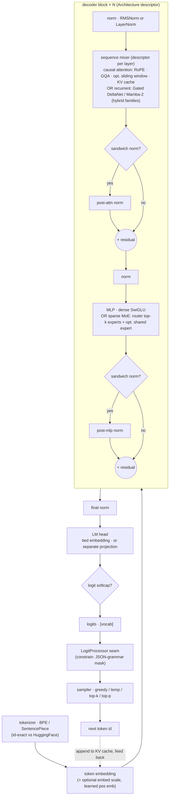
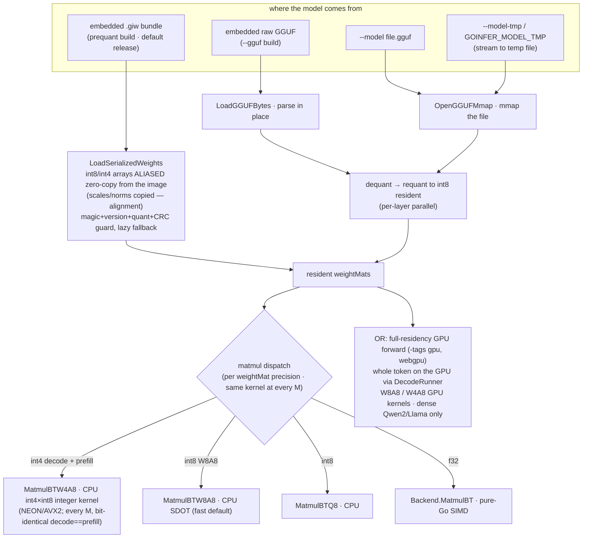
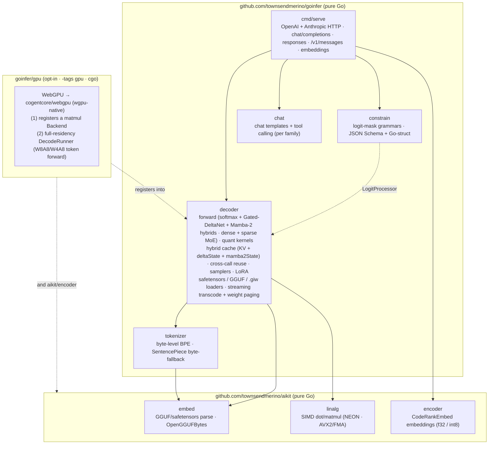

# goinfer architecture

A tour of how goinfer turns a prompt into tokens, and how the model gets from a
file (or the binary's own image) into RAM. Three diagrams: the **forward pass**,
the **load + memory paths**, and the **module map**.

> These diagrams are intentionally drawn at the *stage* level, not the
> struct-field level. goinfer is descriptor-driven — one generic decoder runs
> Gemma 3/4, Qwen 2.5/3 (+ Qwen2.5-VL), Llama, Mistral, GPT-2, Mellum/Mellum2, and
> the MoE families (Mixtral, Qwen-MoE, GLM-4.5/4.6, Granite-4.0-H) by reading an
> `Architecture` descriptor — so the per-model specifics (which norm, GQA ratio,
> RoPE scaling, tied vs separate head, **MoE routing variant**) are *config*, not
> separate code paths. Even the sparse-MoE FFN is mostly config: a router scores
> experts, the top-k run as gated MLPs, plus an optional always-on shared expert —
> one `moeMLP` covers Mixtral (softmax top-k), Qwen-MoE (sigmoid-gated shared), GLM
> (DeepSeek sigmoid routing + an `e_score_correction_bias` that steers selection +
> an ungated shared expert), and Granite (the same, fused experts). Drawing stages
> keeps these accurate across new families; the numeric contract is the parity gate
> against HuggingFace, not this doc.
>
> **The exceptions to "config, not code paths"** are the two **hybrid** families,
> which add genuinely new *sequence-mixing primitives* — descriptor-selected per
> layer, not config knobs — both running over a hybrid cache (KV for the softmax
> layers + a per-layer recurrent state):
>
> - **Qwen 3.6 / `qwen3_5_moe`**: most layers are **Gated DeltaNet** (linear
>   attention with a recurrent matrix state) — `deltanet.go`, state `deltaState`.
> - **Granite-4.0-H / `granitemoehybrid`** (and **Nemotron-H / `nemotron_h`**, a
>   single-op-per-block variant): a mix of **Mamba-2 selective state-space** layers
>   and softmax attention, MoE on every layer, plus four
>   Granite scalar multipliers (embedding / attention / residual / logits) —
>   `mamba2.go` (sequential scan + an equivalent chunked scan), state `mamba2State`
>   (`{conv window, SSM state}`), forward in `forward_granite.go` / `forward_nemotron.go`.
> - **DeepSeek-V2/V3 / `deepseek_v2` `deepseek_v3`**: **Multi-head Latent Attention**
>   — the third axis, *latent-KV*. K/V compress to a shared low-rank latent
>   (`kv_lora_rank`) which is the ONLY thing cached (a new **latent cache kind**,
>   `KVCache.mlaLatent`, alongside full-KV and recurrent state); per-head K/V are
>   reconstructed from it each step, with decoupled RoPE on a separate slice. The
>   per-head q·k width differs from the v width, so it runs its own attention rather
>   than the uniform path — `forward_deepseek.go`. MoE rides the shared `moeMLP`
>   (config-driven softmax-V2 vs sigmoid-group-V3 routing).
>
> Each has a dedicated forward and is
> excluded from multi-token batched prefill — their recurrence / latent
> reconstruction is inherently sequential. A new mixer (or attention-kind) is one new
> primitive + its parity test on the existing per-layer-kind scaffolding, which is
> what let Granite (Mamba-2) land on the shapes qwen3_5_moe (DeltaNet) first proved,
> and MLA's latent cache slot in beside them.

## 1. The forward pass (one decode step)

Each generated token runs the full stack once. Prefill runs the prompt tokens
through the same path (filling the KV cache) and only keeps logits for the last.



The **`LogitProcessor` seam** is where `constrain` lives: it masks each step's
logits *before* sampling, so a JSON grammar makes malformed output literally
unreachable — independent of model size.

## 2. Load + memory paths

The same resident weight bundle can be reached four ways. The differences are
purely *where the bytes come from* and *how much heap they cost* — the forward
pass above is identical afterward.



Why the `.giw` path is the headline: it skips decompress **and** dequant/requant
**and** the resident-weight heap copy — the int8 weights are mapped straight from
the binary's read-only image. Measured on Qwen2.5-Coder-0.5B (M-series CPU):

| metric | embedded GGUF | prequant `.giw` | win |
|---|---|---|---|
| cold start | 2.30 s | 0.48 s | ~5× |
| resident heap (`phys_footprint`) | 772 MB | 78 MB | ~10× |
| binary size | 475 MB | 617 MB | +30% |

The RAM win scales with model size, which is what lets the demo ship in **two
size tiers** from one program (prequant `.giw`, M-series CPU, fixed prompt+seed):

| tier | binary | cold start | resident heap | tok/s (demo) |
|---|---|---|---|---|
| Qwen2.5-Coder-0.5B | 617 MB | 0.48 s | 77 MB | ~57 |
| Qwen2.5-Coder-1.5B | 1.72 GB | 1.23 s | 87 MB | ~26 |

(End-to-end demo tok/s, M1 Pro, after the v0.5.0 perf work — see
`docs/completed/perf-campaign.md`. Pure runtime decode is higher: ~70 / ~36 tok/s on
`BenchmarkDecode`; the gap is streaming/UI overhead. ±a few tok/s by thermal
state.)

The 1.5B has ~3× the weights but **near-identical resident heap** (77 → 87 MB) —
they're image-mapped, not heap-copied — and stays under GitHub's 2 GiB asset cap.
Without prequant the 1.5B would need a ~1.7 GB weight heap per launch; that's the
enabler. (Looking further, a 4B int8 model no longer needs a ~5 GB weight heap,
which is what makes a `FROM scratch` container demo viable.) Quant is fixed when
the `.giw` is built; the runtime `--quant` flag and
the GGUF fallback apply only to the `--model <gguf>` path. Any bundle
mismatch (magic / version / quant / CRC) returns a typed error — never a panic —
and the user falls back via `--model`.

**Running bigger than RAM (`--stream-weights`).** The `.giw` is also an mmap-able
substrate: with `--stream-weights` the weights are paged on demand out of a
read-only mapping under a RAM budget (`--weight-cache`) instead of all held
resident — MoE expert demand-paging (run a 35B-A3B in ~16–20 GB) or dense per-layer
streaming. Bit-exact (read-only re-fault), trading RAM for cold-miss fault latency.
A plain `.gguf` is transparently transcoded to a sidecar `.giw` on first use, and
that transcode is itself **streaming** — `StreamTranscodeGGUF` converts one layer at
a time, so a model far larger than RAM (e.g. a 106B-A12B at int4) prequantizes with
a peak of ~one layer, not the whole model. Validated on real GLM-4.5-Air (106B):
prequantizes and then loads + generates via expert-paging on a 62 GB host.

**Two GPU modes (`-tags gpu`, WebGPU).** (1) A per-matmul `Backend` that
substitutes for the f32 kernel — the original, arch-agnostic path. (2) **Full
residency** (v0.4.0+): the *entire token forward* runs on the GPU through
`DecodeRunner`, with **quantized** GPU kernels — `W8A8` (int8) and `W4A8` (int4).
This is the headline: a **7B int4 fits and decodes pure-GPU on an 8 GB card**
(~51 tok/s — the model class that does *not* fit at int8). *(The old "~71% of
llama.cpp-CUDA" figure is the WebGPU-backend 7B row measured for v0.5.0 (~2026-06,
51.7 vs 72.8); it is stale and pre-coalescing. **§B was RETIRED 2026-08-27** — withdrawn,
not re-measured, and archived in `benchmarks-archive.md`. Current peer numbers against
Ollama v0.32.5: `benchmarks.md` **§B8**.)* v1 residency limits: stateless `Generate` only
(Session/prefix-reuse fall back to staged), 16k context (f32 KV) — or **~32k with
the opt-in f16 KV cache (`--kv f16`, v0.5.0) / ~64k with int8 KV (v0.6.0)** at the
same VRAM.

**Residency coverage has since widened to most families served (post-v0.7.0).** A
ladder of bounded eligibility "levers" moved the staged-only archs onto the resident
runner: **MoE** (Mixtral, qwen2_moe, **GLM-4.5/4.6**, and **DeepSeek-V2/V3 + Kimi-K2**
via a **MLA latent-attention** residency bridge — C4/C5), **sliding-window** attention
(Mistral — C6), and **per-layer RoPE** (Mellum — C7). On top of that sits a **resident
Mamba-2 SSM decode engine** — the reframe that *decode is a bounded per-token recurrence,
not the prefill scan* — which brings the **hybrid SSM families onto the GPU**:
**Nemotron-H** (dense Mamba-2 / NoPE-GQA / squared-ReLU MLP) is **resident-DEFAULT at int4**
(near-lossless — perplexity within noise of f32, KL 0.058 — and ~10× CPU), and
**Granite-4.0-H** ports cleanly but stays **opt-in** (its int8 path hits a *fundamental*
quant cliff where its 64-expert MoE router turns tiny perturbations into discrete
expert-selection flips — see `docs/ssm-int8-quality.md`). Still staged: **Gemma** (logit/attn
softcap own-forward), **Llama-4** (ports cleanly but needs ≥12 GB), gpt2. Full numbers:
`docs/completed/gpu-assessment.md`, `docs/gpu-residency-coverage.md`, `docs/completed/decode-residency-campaign.md`.

## 3. Module map (and where cgo is quarantined)

goinfer is the LLM-runtime half; the tensor/embedding primitives live in
`aikit`. On top of the `decoder` sit `chat` (per-family chat templates + tool
calling), `constrain` (schema-constrained decoding), and `cmd/serve` — an
HTTP server speaking both the OpenAI surface (chat/completions, completions,
Responses, with cross-call KV reuse) and the **Anthropic Messages API**
(`/v1/messages`), plus embeddings via aikit's `encoder`. Everything in the default
build is pure Go, no cgo. The one cgo dependency (`cogentcore/webgpu`) is sealed
inside the opt-in `goinfer/gpu` submodule, built only under `-tags gpu`.



The arrows into `gpu` are dashed because the dependency is *inverted*: `gpu`
imports `decoder`/`encoder` and registers into them on init, so `webgpu` never
enters the core module graph. The default `go build` pulls only `aikit` +
`golang.org/x/text` — pure Go, no cgo. (Native GPU is cgo via wgpu-native; a
future browser/wasm backend would reach `navigator.gpu` through `syscall/js`,
cgo-free — see `docs/roadmap.md`.)

## The contract

Numerics — the forward pass and quantization — are **parity-gated against
HuggingFace** and are the stable surface. The loader and `Architecture`
descriptor move as new model families and quant formats land, and **v1.0 will not
freeze them**: `docs/api-tiers.md` (signed off 2026-08-18) names the descriptor,
the loader internals and the residency seam as Experimental *explicitly*, so
"still moving" is a stated exclusion rather than an unstated risk. That is also
why the `.giw` format carries a version guard (a stale bundle triggers a safe
rebuild via the GGUF path, never a crash).

## Modules and packages

Moved here from the README (2026-08-27) so the front page stays short; the content is unchanged.

### Modules

goinfer ships as **five Go modules**. The three GPU backends are separate modules so their
dependencies (`cogentcore/webgpu` and its cgo, `eitamring/gocudrv`, `ebitengine/purego`) never
enter the dependency graph of a build that doesn't ask for them, and `demo/agent` is separate for
the same reason — it keeps the MCP SDK out of the root's dependency-light `go.mod`.

| Module path | Contents |
|---|---|
| `github.com/townsendmerino/goinfer` | everything in the Packages table below except the three backends |
| `github.com/townsendmerino/goinfer/gpu` | WebGPU backend (`-tags gpu`) |
| `github.com/townsendmerino/goinfer/cuda` | native CUDA backend (`-tags cuda`) |
| `github.com/townsendmerino/goinfer/metal` | native Metal backend (`-tags metal`) |
| `github.com/townsendmerino/goinfer/demo/agent` | the local RAG coding agent — separate so the MCP SDK stays out of the root |

**Four of the five are the ones you build against**; `demo/agent` is a demo, not a surface, and is
not covered by `docs/api-tiers.md`. It is listed here because `go.work` and the release ritual both
treat it as a module — `RELEASING.md` tags five, and a cross-module change that forgets it fails
there rather than here.

**You normally name only the root**, because the root alone is all a pure-Go build needs. Since
the M-19 split its `go.mod` requires NONE of the backend modules — `go get
github.com/townsendmerino/goinfer` brings the root only, and a `-tags cuda` build needs the cuda
module named explicitly. (N-39/N-38: this used to say the root "requires the other three … so a
`-tags cuda` build resolves without further action", which stopped being true when the requires
were removed.) Name a backend module to build against it, or to pin, vendor, or audit it:

```bash
go get github.com/townsendmerino/goinfer/cuda@latest
```

**The backend modules are versioned independently of the root and of each other** — they are
not in lockstep, since a root-only release doesn't retag them. Backend tags carry the module
path as a prefix (`gpu/vX.Y.Z`, `cuda/vX.Y.Z`, `metal/vX.Y.Z`), which is how Go's module proxy
resolves a submodule tag; the bare `vX.Y.Z` tags are the root's. Check the
[releases page](https://github.com/townsendmerino/goinfer/releases) for what is current — and
when in doubt, take the root's requirement rather than picking a backend version yourself.

## Packages

| Package | Purpose | Deps beyond stdlib |
|---|---|---|
| `decoder` | generic decoder-only forward pass; f32/bf16/f16 + int8/int4; safetensors/GGUF/GPTQ/AWQ; KV-cache; samplers | `aikit/embed`, `aikit/linalg`, `goinfer/tokenizer` |
| `tokenizer` | BPE tokenizers the decoder LLMs ship — byte-level + SentencePiece byte-fallback, from `tokenizer.json` or a bare `.gguf`; HF-exact id parity | `aikit/embed`, `golang.org/x/text` |
| `constrain` | constrained / structured decoding — a logit mask that forces output to satisfy a grammar; streaming JSON grammar + JSON Schema (and Go-struct) compiler | — |
| `chat` | chat-template detection + byte-exact native renderers (Gemma 3/4, ChatML/Qwen, Llama-3, Mistral) and per-family tool calling (render + parse) | — |
| `gpu` (opt-in, `-tags gpu`) | WebGPU compute backend for matmul (Metal / Vulkan / DX12) | `cogentcore/webgpu` (cgo), `aikit/encoder`, `goinfer/decoder` |
| `cuda` (opt-in, `-tags cuda`) | cgo-free native CUDA decode backend — dlopen libcuda + NVRTC, dense residency, `CGO_ENABLED=0` | `eitamring/gocudrv`, `goinfer/decoder` |
| `metal` (opt-in, `-tags metal`) | cgo-free native Metal decode backend — purego / Obj-C, MSL compiled at runtime, dense residency, darwin, `CGO_ENABLED=0` | `ebitengine/purego`, `goinfer/decoder` |

The cgo WebGPU dependency is confined to the `gpu` submodule; the two native GPU
backends (`cuda`, `metal`) are **cgo-free**. Either way the default build is pure Go,
no cgo — a backend is compiled only when you pass its build tag.
