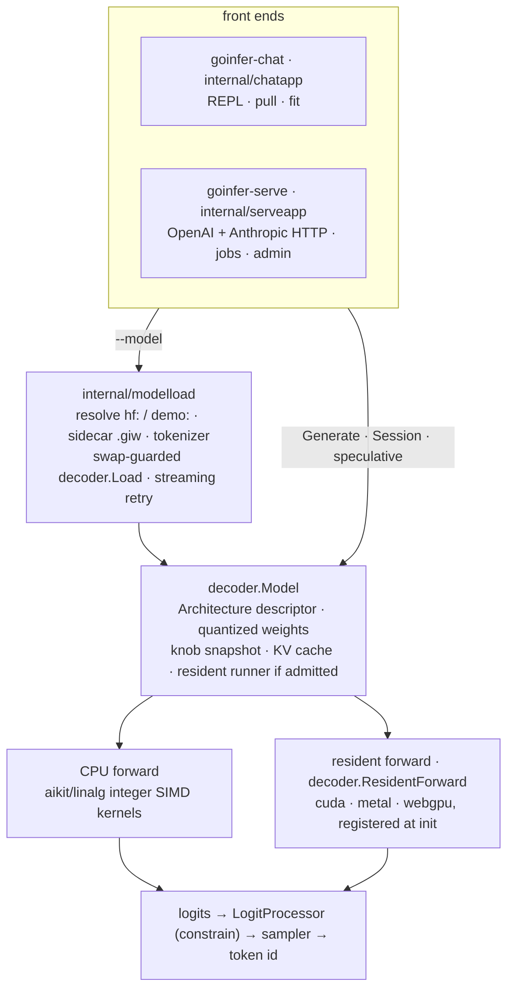
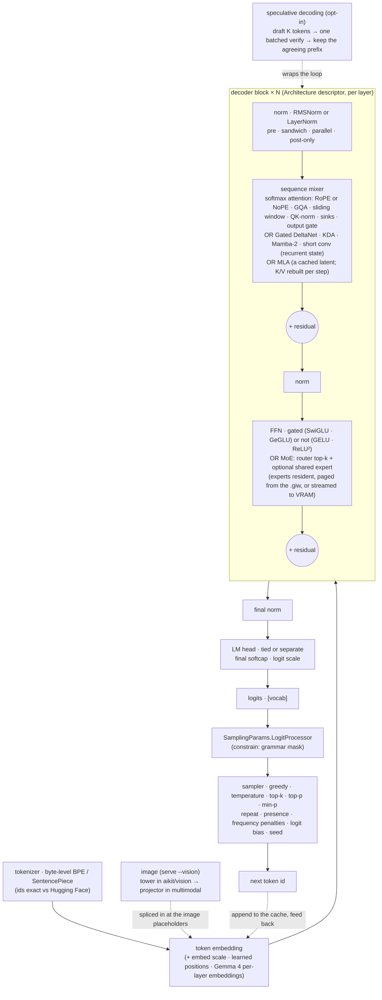
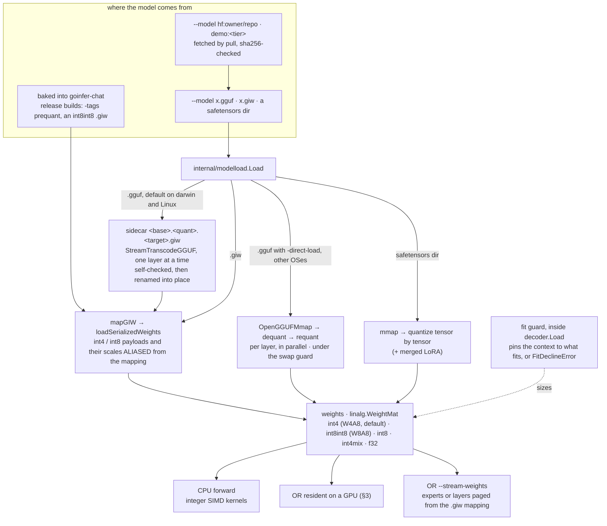
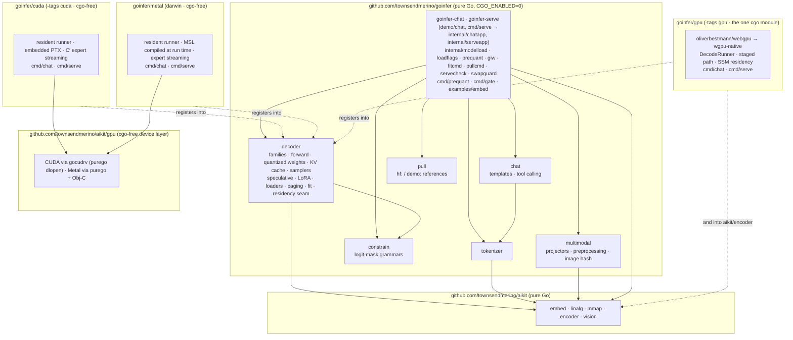

# goinfer architecture

How goinfer turns a prompt into tokens: the pieces, the path a model takes from a file onto the CPU
or a GPU, and the seams between them. It is written for someone about to change the code, so it
names the types and files that carry each idea. It explains shapes. The tables generated from the
code are the truth for *what runs where*, and this page does not restate them.

> **Rewritten 2026-09-25** against `main` at `1869c724` (after v0.19.0). The 2026-09-12 text had
> fallen behind on the WebGPU binding, Metal's prefill floor, how residency is admitted, the
> speculative drafters and a `.giw` fallback that was never built. It also did not cover the shared
> load path, per-model knobs, memory accounting or the job queue. This page is on `docs/README.md`'s
> list of pages to trust: when reality moves, fix it here.

| generated or kept elsewhere | the truth for |
|---|---|
| [capability-matrix.md](capability-matrix.md) — `go test ./decoder -run CapabilityMatrix -update` | every model family (37 at this rewrite) and what it supports |
| [hardware-matrix.md](hardware-matrix.md) — `go test ./decoder -run HardwareMatrix -update` | which family runs resident on which GPU backend |
| `testdata/parity_manifest.json`, kept by `cmd/gate` | each family's strongest validation against Hugging Face |
| [env-vars.md](env-vars.md), checked by `TestEnvVars_docAndCodeAgree` | every environment variable goinfer reads |
| [benchmarks.md](benchmarks.md) | every performance number, with its provenance |
| [api-tiers.md](api-tiers.md) | what v1.0 promises not to break |

**Contents**

- [How the pieces fit](#how-the-pieces-fit)
- [1. The forward pass](#1-the-forward-pass): [the descriptor](#one-decoder-read-from-a-descriptor) ·
  [mixers and own forwards](#where-a-descriptor-is-not-enough) · [one decode step](#one-decode-step) ·
  [prefill](#prefill) · [sampling and constraints](#sampling-and-constraints) ·
  [speculative decoding](#speculative-decoding) · [multimodal](#multimodal) · [LoRA](#lora)
- [2. Load + memory paths](#2-load--memory-paths): [sources](#sources) ·
  [the load path](#one-load-path-internalmodelload) · [`.giw`](#giw-prequantized-mapped-aliased) ·
  [quantization and the CPU kernels](#quantization-and-the-cpu-kernels) · [the KV cache](#the-kv-cache) ·
  [fitting to the machine](#fitting-to-the-machine) · [bigger than RAM](#running-bigger-than-ram)
- [3. The GPU backends](#3-the-gpu-backends): [registration and the runner seam](#registration-and-the-runner-seam) ·
  [admission](#admission-which-models-run-resident) · [CUDA](#cuda) · [Metal](#metal) · [WebGPU](#webgpu) ·
  [across the backends](#across-the-backends)
- [4. Serving](#4-serving): [goinfer-serve](#goinfer-serve) · [goinfer-chat](#goinfer-chat)
- [5. Configuration](#5-configuration)
- [6. Modules, packages, and where cgo is quarantined](#6-modules-packages-and-where-cgo-is-quarantined):
  [modules](#modules) · [binaries](#binaries) · [packages](#packages)
- [The contract](#the-contract)

## How the pieces fit



Every dependency points down:

- **Front ends** own the wire format and the flags. `goinfer-chat` is a REPL; `goinfer-serve` is
  the HTTP server (§4). Both reach a model through `internal/modelload` (§2) and drive it through
  `decoder`'s generation API.
- **`decoder`** owns the numerics. It resolves a checkpoint to an `Architecture` descriptor, loads
  and quantizes the weights, and runs the forward pass, the samplers, speculative decoding and the
  KV cache. Its entry points are `decoder.Load(path, Options)` and `Model.Generate` /
  `Session.Generate`, which return token ids on a channel.
- **Backends** own device code. The CPU path is always present. CUDA, Metal and WebGPU are separate
  Go modules that register into `decoder` at init. When a model is admitted, they run the whole
  token forward on the device (§3). The sampler, `constrain` and the session bookkeeping stay on the
  CPU either way. A resident backend hands back logits, or, on its fast paths, an id it has already
  sampled.

## 1. The forward pass

### One decoder, read from a descriptor

goinfer is descriptor-driven. `decoder/registry.go` maps each Hugging Face `model_type` to an
adapter that turns the checkpoint's config into an `Architecture`. Every adapter's output passes one
chokepoint (`resolveArchitecture` → `validateResolved`). A field an adapter forgot therefore fails
there rather than running as a silent zero. A family's specifics are fields, not code paths:

- **norms**: RMSNorm (optionally `1+w`) or LayerNorm, placed pre-norm, sandwich (Gemma's four),
  parallel, or post-only;
- **attention**:
  - the GQA ratio;
  - QK-norm: per head, over the whole vector, or Llama 4's L2;
  - a sliding window;
  - attention sinks;
  - an output gate;
  - a score softcap;
  - attention temperature;
  - chunked attention;
- **position**: either RoPE or learned position embeddings. RoPE can be full or partial and use one
  or two bases. It supports per-layer tables, NoPE layers, m-RoPE for the VL models, and linear,
  llama3, YaRN or dynamic scaling;
- **FFN**: gated (SwiGLU, GeGLU, gpt-oss's clamped SwiGLU) or not (GELU, ReLU²), dense or MoE;
- **the ends**:
  - embedding scale;
  - a tied or separate LM head;
  - final softcap and logit scale;
  - Gemma 4's per-layer embeddings and per-layer geometry: head width, KV heads, KV sharing.

**Sparse MoE is configuration too.** One `moeMLP` (`decoder/mlp.go`) handles the router, the
experts and the shared expert.

- **Routing** goes through `routeExperts`. It scores with softmax or sigmoid, and supports an optional
  selection bias (`e_score_correction_bias`), DeepSeek's group-limited top-k, `norm_topk_prob` and a
  routed scaling factor.
- **The top k experts** run as gated MLPs.
- **An optional always-on shared expert** is added on top. It is sigmoid-gated (Qwen-MoE) or
  ungated (GLM, DeepSeek).

Granite's fused expert tensors are split per expert at load, so `moeMLP` never sees them. Four
families bring their own MoE FFN inside their own layer loop: gpt-oss, Llama 4, Nemotron 3 Nano and
Gemma 4.

The numeric contract for all of this is the parity gate against Hugging Face (*The contract*,
below), not this page.

### Where a descriptor is not enough

Some families add a sequence-mixing primitive that attention's code path cannot express. The
primitive is chosen per layer (`isLinearLayer`, `isMambaLayer`, `isConvLayer`, Nemotron's per-block
kind). Its state lives in the same `KVCache` (`decoder/kvcache.go`) beside ordinary K/V. The
capability matrix files each family under one class (its `coverage_axis`).

**softmax-GQA** — 27 families, among them Llama, Qwen 2/2.5/3 and their MoE and VL variants, Mistral,
Mixtral, Gemma 3 and 4, Phi, GPT-2, gpt-oss and GLM-4.5/4.6.
- Cached per layer: K and V.
- Code: the generic loop (`decoder/model.go`), or an own loop (below).

**Gated DeltaNet hybrid** — Qwen3.5/3.6-MoE (`qwen3_5_moe`), Qwen3.8 (`qwen3_5`), Qwen3-Next and
Olmo Hybrid.
- Cached per layer: K/V on the softmax layers, and a recurrent matrix state (`deltaState`) on the
  linear-attention layers.
- Code: `decoder/forward_qwen35.go` and `decoder/deltanet.go`.

**latent KV (MLA)** — DeepSeek-V2, DeepSeek-V3, Kimi K2 and Ling 3.0.
- Cached per layer: one low-rank latent (`KVCache.mlaLatent`). Per-head K/V are rebuilt from it at
  each step, with RoPE on a separate slice.
- Code: `decoder/forward_deepseek.go`. Ling 3.0 (`bailing_hybrid`) alternates MLA with Kimi Delta
  Attention (`decoder/kda.go`, `kdaState`) in `decoder/forward_bailing.go`.

**Mamba-2 hybrid** — Granite-4.0-H (`granitemoehybrid`) and Nemotron-H (`nemotron_h`).
- Cached per layer: K/V on the attention layers, and a conv window plus SSM state (`mamba2State`) on
  the Mamba layers.
- Code: `decoder/forward_granite.go`, `decoder/forward_nemotron.go` and `decoder/mamba2.go`, which
  is a sequential scan.

LFM2 is filed under softmax-GQA but carries a fifth kind of state: the rolling window of its gated
short convolutions.

**Own-forward families.** The `ownForwards` table in `decoder/arch.go` names the nine families that
run their own layer loop. They are:
- the hybrid and MLA families above;
- four softmax-GQA families whose layers are not uniform: Gemma 4, LFM2, gpt-oss and Llama 4.

Each row (`ownForwardFamily`) carries the bits that every consumer reads, so no consumer keeps its
own list:

- **Being in the table** rules out:
  - CPU batched prefill (`canBatchN`);
  - dense layer streaming;
  - compute-time LoRA;
  - the automatic streaming retry.
- **`Captures`** means hidden-state capture works (`ForwardCapture`), which block drafters need.
- **`Recurrent`** means speculative rollback is refused and prefix reuse is narrowed (see below).
- **`KVInt8` and `KVRings`** say whether `NewCache` may use int8 K/V or sliding-window rings.

`TestOwnForward_tableNamesEveryFamilyForward` fails if a `runLayersXxx` exists that the table does
not name. The list used to be restated per consumer. One copy fell a family behind, and a two-token
LFM2 prompt panicked (audit 2026-09-02, C-01).

**Recurrent state cannot be rewound.** DeltaNet, KDA, Mamba-2 and short-conv state is overwritten
in place at every token, and no backend can checkpoint and restore it. Two consequences follow:
- These families refuse rollback-based speculative decoding (`specRollbackSafe`).
- They reuse a cached prefix only when the new prompt extends the cached one exactly. An edited
  conversation is prefilled again.

`specRollbackSafe` refuses a sliding-window ring for the same reason: a wrapped ring cannot rewind
exactly.

### One decode step

Each generated token runs the whole stack once.



### Prefill

The prompt runs through the same layers to fill the cache. Only the last position's logits are
computed.

**On the CPU.** `prefillLogits` runs the prompt as one batched `M=K` pass (`forwardLayersN`) when the
family uses the generic loop and no compute-time adapter is bound. Otherwise it runs token by token.

The matmuls give the same result at every `M` (§2). **The attention does not.** From 512 prompt
tokens (`fastAttnMinPrompt`), the CPU uses f32 prompt attention by default (since 2026-08-31),
whereas decode accumulates in f64. This has two consequences:
- A long prompt's K/V is not bit-identical to feeding it one token at a time (cosine ≈ 0.9976 at
  dense 1.5B).
- A session that prefills in two chunks can differ from a one-shot prefill.

To get the exact path back, use `--cpu-exact-prefill` (CPU only) or `--exact-prefill` (every
backend). Speculative verify always uses the exact path.

**On a resident backend.** `residentPrefillSeed` hands a suffix of 8 or more tokens to the backend's
batched prefill (`Prefiller.PrefillLast`) when no adapter is bound. A shorter suffix runs token by
token. Each backend's floor for its fast prefill kernels is in §3.

`Model.PrefillPath()` states at load which path this model will take, and why. serve prints it in
its banner, so a slow path is visible before the first request rather than discovered under load.

### Sampling and constraints

`SamplingParams` (`decoder/sampler.go`) is the per-request policy. It covers:
- temperature (0 is greedy), top-k, top-p and min-p;
- the seed;
- repeat, presence and frequency penalties over a window;
- logit bias;
- logprobs;
- extra stop ids.

A temperature-only draw is Gumbel-max over a Philox stream. That is what lets a GPU backend sample on
the device and still agree with the CPU. Greedy, top-K and Gumbel sampling each have an optional
device path. A device path is taken only when a predicate (`ArgmaxEquivalent`, `TopKEligible`,
`SampleEligible`) says the result is the same.

**Constrained decoding** is the `SamplingParams.LogitProcessor` hook: a function that edits each
step's logits after the forward and before the sampler. A disallowed token, an early EOS included,
is therefore unreachable at any model size. `constrain` supplies the hook: a streaming JSON grammar
compiled from a JSON Schema or a Go struct. It can be applied two ways:
- at every step (`Masker`);
- only from the moment the model opens a tool call until the call is complete (`LazyMasker`, with
  `LogitProcessorGate`). Prose around the call then stays free.

serve uses it for `response_format` and for tool calls: a forced tool, or the union of the declared
tools.

### Speculative decoding

A drafter proposes K tokens, and the target scores all K in one batched forward. On the CPU that is
`forwardN`, always with exact attention; on a GPU it is the resident `ForwardN` (§3). The longest
prefix the target agrees with is emitted.

| drafter | how it drafts | where | backends | output |
|---|---|---|---|---|
| n-gram | copies a span that already occurs in the context; the draft depth adapts each round (`AdaptiveDepth`) | chat and serve, `--spec ngram` | CPU and all three resident backends. It declines on a backend whose batched verify is no cheaper than plain decode (`thetaFor`) | greedy: identical to plain decode. Sampled: the target's own distribution (`TestSpecStepLossless`) |
| grammar-fused | a router (`RouterDrafter`) between n-gram and the grammar's forced bytes (`GrammarDrafter`), verified under the same mask | serve, automatically, for a greedy constrained request | as n-gram | greedy only |
| draft model | a smaller model with the same vocabulary | chat, `--draft` | CPU, or verified on the resident target | greedy only |
| DFlash block drafter | a pretrained drafter that reads the target's hidden states and proposes a whole block | serve, `--drafter` | CUDA | greedy only |

Speculation is refused where it could not be exact:
- recurrent families and sliding-window rings (`specRollbackSafe`);
- any other `LogitProcessor`;
- configurations whose decode and verify would run different kernels (`SpecDecodeConflict`).

A DSpark drafter (`decoder/dspark.go`) is in the tree with no caller. Two drafter heads were removed
because they did not pay, and their records stay:
- EAGLE-3 on 2026-09-24 (`be9aeea8`; `docs/spec/05-eagle3-head.md`);
- the MTP head adapter on 2026-09-25 (`1869c724`; `docs/spec/09-mtp-heads.md`, whose Gate 1 section
  says how to restore it).

### Multimodal

Vision in, text out, and on serve only (`--vision`).

- **Towers** live in `aikit/vision`: SigLIP for Gemma 3, Gemma 4's own ViT, and the
  dynamic-resolution ViT for Qwen2.5-VL.
- **`multimodal`** holds the goinfer side: projectors, image-token blocks, preprocessing, and image
  hashing.
- **Splicing.** The image's embeddings go into the prompt at its placeholder tokens (`GenerateVL`,
  `GenerateQwenVL` with m-RoPE positions, `GenerateGemma4VL`). The text decoder is unchanged.
- **Qwen3-VL** loads as a text-only decoder.
- **Where towers run.** The SigLIP tower runs resident on WebGPU and CUDA (`vision.RegisterResident`).
  The other towers run on the CPU, and the text decode after them stays resident.
- **Hashing.** Each image is hashed (FNV-64a of its bytes), so resident prefix reuse survives an
  image turn.

### LoRA

PEFT adapters apply two ways:

- **Merged at load** (`Options.LoRA`; `--lora` in chat and serve, and per model in serve). The
  adapter is added into the f32 weights before quantization, so decode costs nothing extra.
  Safetensors bases only.
- **Applied at compute time, several per model** (`Model.LoadAdapter`, `Session.UseAdapter`;
  serve's `--adapter serveName=base=dir`). One base is shared, and each request picks its adapter.
  - Bases: generic-loop, dense, gated-MLP safetensors models only.
  - The CPU runs prefill and verify at `M=1` while an adapter is bound.
  - All three GPU backends implement `SetAdapter`.

## 2. Load + memory paths

The same resident weights can be reached several ways. They differ in where the bytes come from and
how much RAM they cost. The forward pass afterwards is identical, and the precision is fixed at
load.



### Sources

- **Baked into the binary.** The release `goinfer-chat` builds carry a model in their own image, in
  two tiers: Qwen2.5-Coder 0.5B and 1.5B, sha256-pinned in `.github/workflows/release-assets.yml`.
  - `demo/chat/build-embed.sh` prequantizes the model to a `.giw` (int8int8, canonical layout) and
    builds with `-tags prequant`.
  - `-tags embed` is the alternative: it bakes in the raw GGUF and quantizes at launch.
  - Chat only.
- **`--model`** takes any of:
  - a `.gguf`;
  - a `.giw`;
  - a Hugging Face safetensors directory: bf16, f16 or f32, or a GPTQ, AWQ or FP8 checkpoint, which
    is dequantized and requantized to `--quant`;
  - a reference, `hf:owner/repo[:quant|:file.gguf]` or `demo:<tier>`. `pull` downloads it into a
    cache on first use, checking every file's sha256.

### One load path: `internal/modelload`

serve, chat and `fit` all load through `modelload`. They used to do it three ways, and the copies
drifted: serve alone retried a fit decline with streaming, and `fit` could not resolve `hf:`
references. `modelload.Load` runs these steps:

1. It resolves a reference.
2. It decides what to load. A `.gguf` becomes its sidecar `.giw` (below), unless the platform,
   `-direct-load` or `--embed-int4` says otherwise. `--stream-weights` always needs the `.giw`.
3. It loads the tokenizer, from the `.giw`'s metadata half, the GGUF itself, or `tokenizer.json`.
4. It calls `decoder.Load`. A direct `.gguf` build runs under the swap guard
   (`internal/swapguard`). If swap grows past `GOINFER_SWAP_GUARD` (512 MB by default), the build
   aborts between layers with an error that names the priced memory terms.
5. If the fit guard declines a dense model's direct load (`FitDeclineError.DenseStreamable`), it
   retries once with weight streaming. `--fit=off` disables the retry.
6. It refuses an explicit `--quant` that a prequantized `.giw` cannot honour (`CheckGiwQuantMatch`).

A few loads stay outside it: the baked-in model, chat's `--draft` model, serve's `--embed-model` and
`--drafter`, and `cmd/prequant`. `fit` resolves through `modelload` and then loads by itself,
through a fresh sidecar that chat or serve already built, when one exists. It never transcodes.

### `.giw`: prequantized, mapped, aliased

A `.giw` is goinfer's prequantized bundle. It has two layers:
- **The frame** (`internal/giw`) holds a serialized weight blob plus a metadata-only GGUF that
  carries the tokenizer and config.
- **The weight blob** (`decoder/serialize.go`) is written as format version 12, or 14 for the Metal
  target. Readers accept 3 through 14.

The weight blob is mapped read-only, and parts of it are **aliased** straight out of the mapping: the
int4/int8 payloads, plus their scales (f32 scales since v12, f16 since v14). Nothing is
decompressed, nothing is dequantized and requantized, and nothing is copied to the heap. Only norms
and biases are copied. On darwin the mapping is `MAP_SHARED`, and Metal can wrap the aliased pages
as device buffers without a copy (S6, §3).

**Why it is the headline.** The RAM win scales with model size. It is what lets one program ship
with a model inside it, in two tiers. It is also what makes a bigger-than-RAM model runnable at all,
because `--stream-weights` pages from the same mapping. The v0.5.0-era measurement that established
it is kept as the record (Qwen2.5-Coder-0.5B, M1 Pro, prequant int8; current numbers are in
`benchmarks.md` §A):

| metric | embedded GGUF | prequant `.giw` | win |
|---|---|---|---|
| cold start | 2.30 s | 0.48 s | ~5× |
| resident heap (`phys_footprint`) | 772 MB | 78 MB | ~10× |
| binary size | 475 MB | 617 MB | +30% |

The 1.5B tier had about 3× the weights and nearly the same resident heap (77 → 87 MB), because the
weights are mapped from the image rather than copied to the heap.

**Where `.giw` files come from.**
- **`cmd/prequant`** builds one from a GGUF or a safetensors checkpoint.
- **The sidecar.** A `.gguf` given to chat or serve is transcoded **once** to a sidecar beside it,
  named `<base>.<quant>.<target>.giw`.
  - It is the default on darwin (since 2026-09-22) and Linux (since 2026-09-24).
    [measurements/cpu-giw-vs-direct-2026-09-24.md](measurements/cpu-giw-vs-direct-2026-09-24.md)
    found no CPU decode cost, and a load that maps in about 0.01 s instead of requantizing for
    5–16 s.
  - `StreamTranscodeGGUF` writes the sidecar one layer at a time, so a model never has to fit in RAM
    to be prequantized. The result is checked by loading it, then renamed into place.
  - The target in the name is the weight layout (`GIWTargetForBackend`: `canonical`, `cpu-arm64`,
    `cpu-amd64`, `metal`, `cuda`, `webgpu`). A backend that needs a layout the file does not carry
    fails at load.
  - `-direct-load` (or `GOINFER_GGUF_DIRECT`) loads the `.gguf` into the heap instead, as other
    platforms always do.

**Validation** returns a typed `*SerializeError`, never a panic. It checks:
- magic and version range;
- the CRC, verified once per file and remembered in a `<file>.giw.verified` marker
  (`GOINFER_GIW_VERIFY=always` rechecks);
- config and layer count;
- truncation;
- the quant tag against the tensor kinds;
- shapes.

What follows depends on the source:
- A stale or broken **sidecar** fails its freshness check and is rebuilt.
- A **baked-in** bundle, or a `.giw` named with `--model`, refuses to start and says to rebuild it.

This page used to promise an automatic fallback to the GGUF path; that fallback was never built.

### Quantization and the CPU kernels

**The default is `int4`.** `--quant` defaults to `int4` in chat, serve and `fit`. That is W4A8: int4
weights, int8 activations. The embedding and LM head are kept at W8A8 unless you pass serve's
`--embed-int4`. The alternatives:
- `int8int8` (W8A8), where accuracy matters more than RAM;
- `int8` (weight-only);
- `int4mix`: the FFN at int4, attention and the router at int8 (GGUF sources only);
- `f32`, the reference.

A bare `decoder.Options{}` means f32. [quantization.md](quantization.md) has the numbers and caveats.

**A `.giw` carries its quant.** On the sidecar path, `--quant` chooses which sidecar is built. An
explicit `--quant` that disagrees with a `.giw` you named is refused rather than silently ignored.
Metal's resident build runs every quantized weight as int4, because it has no int8 GEMV kernel.

**The CPU kernels** are integer SIMD in `aikit/linalg`, written in hand-written assembly: NEON and
SDOT on arm64, AVX-512 VNNI or AVX2 on amd64. `decoder/weightmat.go` dispatches each
`linalg.WeightMat` by its precision:
- `MatmulBTW4A8Into` (int4);
- `MatmulBTW8A8Into` (int8int8);
- `MatmulBTQ8Into` (int8);
- `MatmulBT` (f32);
- the `…Batch` forms, for fused QKV and gate/up projections.

int4 weights are repacked for the host: row4 on arm64, split-half on amd64. The `M=1` and `M>1`
kernels are bit-identical, so a matmul gives the same answer in decode and in prefill.

### The KV cache

`KVCache` holds, per layer, whatever that layer's mixer needs (§1). On the CPU:
- K/V is f32, or int8 with `--kv i8`: one scale per position and KV head, stored as f32. int8 is
  only for generic-loop, non-MoE families.
- A sliding-window layer keeps a ring the size of its window.

A resident backend keeps its own cache on the device, laid out its own way:

| | K/V precision | MLA | context when not pinned |
|---|---|---|---|
| CPU | f32, or int8 (`--kv i8`) | the latent | the model's maximum, unless the fit guard lowers it |
| CUDA | f32, whatever `--kv` asks | one latent buffer | 4096, grown toward 8192 under `--fit` |
| Metal | f16, or int8 (`--kv i8`); padded to 8 positions | not resident | 4096 (up to 32768) |
| WebGPU | f32, f16 or int8 (`--kv`) | resident | a ceiling of 16k / 32k / 64k by precision |

On sliding-window layers, CUDA and Metal allocate the full context and mask it, where the CPU keeps
a ring. `--ctx` pins the resident context.

### Fitting to the machine

Two mechanisms, easily confused:

**The fit guard** runs inside every `decoder.Load` (`decoder/fitguard.go`). It exists so that a load
refuses instead of swapping. It prices a load against `WeightsMemFraction` (0.70) of available RAM:
- **a direct load**: the weights, KV at the model's maximum context, and the mapped source;
- **a `.giw` load**: only KV and scratch, since the weights are mapped.

In either case it pins the context to what fits, or returns a `*FitDeclineError`. Only
`GOINFER_NO_FIT_GUARD` turns it off.

**`--fit`** (on by default) lets two things you left unpinned grow to the machine:
- CUDA's context, from 4096 toward 8192;
- modelload's automatic streaming retry.

`--fit=off` keeps the flat defaults.

**The planner** is `Model.Plan(backend, free, req)` (`decoder/fitplan.go`). For a backend and a
memory budget it returns a placement (resident, expert-cached, weight-paged or decline) and the terms
it priced. The **`fit` subcommand** (`goinfer-chat fit <model>`) loads the model and prints that
placement for every backend compiled into the binary. `-measure` also times decode on the best one.

**Each memory quantity is computed in one place**, so the planner and the guards cannot disagree
([tasks/task-memory-accounting-2026-09.md](tasks/task-memory-accounting-2026-09.md)):

- `Model.ResidentKVBytes(backend, ctx, f16, i8)`: the KV cache as that backend allocates it (the
  table above). Pinned against the real allocations on CUDA and Metal.
- `Model.ResidentHostCopyBytes`: the second copy of the weights that unified memory holds on Metal,
  less whatever is aliased from a `.giw`.
- `Model.ResidentNeedBytes`: weights at a slot count, plus that host copy, plus KV. Metal's guard
  calls it, and `Plan` builds the same number from the same pieces.
- `decoder.WeightsMemFraction`: the single 0.70.
- `RegisterMemoryProbe`: how a backend tells `Plan` and `fit` how much device memory is free.

serve also admits each request's KV and scratch before its prefill (`AdmitPrefillMemory`).

### Running bigger than RAM

`--stream-weights`, in chat and serve. Instead of holding every weight resident, the model pages
weights on demand from the read-only `.giw` mapping, under a `--weight-cache` budget (0 means half
of available RAM). A `.gguf` is transcoded to its sidecar first; a baked-in chat model cannot be
streamed and says so. Streaming is bit-exact, because a fault re-reads the same bytes; the cost is
fault latency.

**MoE expert paging** (`expertPager`, `decoder/moepaging.go`) touches only the experts the router
picks. `--moe-pager` chooses between two modes:
- **`mmap`**, the Linux default: one LRU spans every layer. It issues `madvise` WILLNEED as the
  router chooses and DONTNEED on eviction.
- **`pool`**, the darwin default, where DONTNEED does nothing: experts are `pread` into owned
  buffers, with an LRU over slots.

A 35B-A3B runs in about 16–20 GB this way. A load whose predicted rate is under 2 tok/s is refused
without `--accept-slow`.

**Dense streaming** (`layerPager`, `decoder/layerpaging.go`) keeps a window of layers. It prefetches
one layer ahead and drops what is behind, while the embedding and head stay resident. Own-forward
families are excluded.

## 3. The GPU backends

Three backends, each its own Go module (§6), each able to run the whole token forward on the device.
CUDA and Metal are cgo-free. WebGPU is the project's one cgo dependency.

### Registration and the runner seam

**Registration.** A backend module imports `decoder` and registers itself in `init()` with
`decoder.RegisterBackend("cuda" | "metal" | "webgpu", …)`. Some also register:
- a memory probe (CUDA, Metal);
- a resident vision tower (CUDA, WebGPU);
- an embeddings backend for `aikit/encoder` (WebGPU).

The dependency therefore points from the backend into the core, and no GPU library enters the root
module.

**Getting a backend into a binary.** A binary gets a backend by importing it.
`{cuda,metal,gpu}/cmd/{chat,serve}` each blank-import their own. The root `cmd/serve` and
`demo/chat` refuse to build with a backend tag.

At run time, `--backend` (default `cpu`) picks one by name. A name the binary was not built with
falls back to the CPU with a note. `--version` lists what is compiled in, and serve's
`--require-backend` exits instead of falling back.

**Two seams.** `decoder.Backend` (`decoder/backend.go`) is per matmul. The CPU implements it, and
WebGPU implements it on the device for its staged path (below).

`decoder.ResidentForward` (`decoder/residency.go`) is the whole token, built by the backend's
`BuildResident`:

- `Forward(embedding, pos)` returns one token's logits and appends its K/V on the device.
- `ForwardN(embeddings, startPos)` returns K rows of logits: the speculative verify. It must be
  bit-identical to K `Forward` calls.
- `UploadKV` writes K/V computed on the CPU (an image prefill, say) into the device cache.
- `TruncateTo`, `Reset`, `Close`.

About a dozen optional interfaces sit around it, found by type assertion:
- batched prefill (`Prefiller`);
- device sampling;
- prefill without logits;
- hidden-state readout;
- compute-time LoRA (`ResidentAdapter`);
- image and m-RoPE prefill;
- a context cap (`ResidentCapped`);
- the load-time reporters (`PrefillPathReporter`, `VerifyPathReporter`), which say which path a
  model will take.

### Admission: which models run resident

At the end of every load, `withResidency` decides whether to build a resident runner. Since
`507cc06c`, it applies the same gates the published matrix does, in this order
(`Model.residentAdmission`):

1. **Runner shape and precision policy** (`decodeRunnerDecline`). The architecture must be one the
   uniform-layer runners can express.
   - An own-forward family passes only once it has been bridged. Gemma 4, gpt-oss and the DeltaNet
     hybrids have been; Llama 4 and LFM2 have not.
   - Granite-4.0-H needs `GOINFER_SSM_RESIDENT`.
   - Nemotron-H runs resident by default at int4 only.
2. **What the backend implements** (`residentGateReason`).
   - Every `ResidentFeature` the architecture needs must be in the backend's declared set
     (`residentBackendFeatures`, in `decoder/features.go`). Features include QK-norm, sliding
     window, the softcaps, MoE, MLA, SSM, DeltaNet, KDA and sinks.
   - Then come the MoE router's capacity, per-layer geometry, and Gemma 4's MoE.
   - A decline names its gate: *"metal does not implement [kda mla], which this model needs"*.
3. **The backend's own build** (`BuildResident`) can still decline, above all for memory. It does so
   with a typed reason (`DeclineResident`), which becomes the model's `ResidentDecline()`. Any other
   error is a failure, not a decline.

`hardware-matrix.md` is generated from `decoder.ResidentEligible(arch, backend)`, which is steps 1
and 2 without a model. The page and the runtime therefore agree by construction. The page's
footnotes cover the two model-level differences: Nemotron-H's int4 policy, and WebGPU's Nemotron MoE
block.

**When admission declines.** The decline is recorded (`Model.ResidentDecline()`), and the model runs
on the CPU. On CUDA and Metal that means **all** of it: neither has a partial GPU path, because their
`decoder.Backend` matmuls are CPU calls. WebGPU alone keeps a **staged** path that runs individual
weight matmuls on the device. `Model.DecodePath()` and serve's banner say which of these is running.

### CUDA

The `cuda/` module, built with `-tags cuda` and `CGO_ENABLED=0`.

- **No cgo, and no CUDA toolkit at run time.** The device layer is `aikit/gpu`. It reaches the
  driver through `eitamring/gocudrv`, which uses `purego` to `dlopen` `libcuda.so.1`. The kernels
  ship as prebuilt PTX modules embedded in the binary, and the driver JIT-compiles them. NVRTC is
  used only offline, to regenerate the PTX (`cuda/build_ptx.sh`).
- **Prefill** is batched from 8 tokens for int4 projections. An int8int8 model takes the per-token
  path, and `PrefillPath` says so at load.
  - Two fast kernels, fused attention and a tensor-core int4 GEMM, switch on at **512** prompt tokens
    (`fastPrefillFloor`). They failed the fidelity gate at 256.
  - `GOINFER_CUDA_FAST_PREFILL=0` or `--exact-prefill` turns them off.
- **Decode** uses a flash-decode (split-K attention) lane from 2048 keys
  (`GOINFER_CUDA_FLASH_DECODE`). It is not bit-identical to the exact kernel, and it is off for
  expert-streamed models.
- **CUDA graphs** are opt-in (`GOINFER_CUDA_GRAPHS`). They are off for MLA, and admitted only on an
  exclusive-process or MPS GPU after a self-test.
- **MoE** runs fully resident, or with **C′ expert streaming** (`--moe-cache-experts`,
  `--moe-cache-slots`).
  - The experts stay in pinned host memory, and a VRAM slot cache is filled per token.
  - The copies overlap compute, and the result is bit-identical.
  - The slot count is found by search, because the driver rounds each allocation up to 2 MiB.
  - This is how a 26B-A4B MoE decodes on an 8 GB card.
- **Also resident:**
  - MLA;
  - the DeltaNet hybrids, for decode (their prefill runs per token);
  - Gemma 4, dense and MoE;
  - the SigLIP vision tower;
  - compute-time LoRA;
  - the DFlash block drafter, with its argmax on the device.
- **KV** is f32, whatever `--kv` asks. Unless `--ctx` pins it, the context is 4096. Under `--fit`
  it grows toward 8192 when `Plan("cuda")` says it fits.

### Metal

The `metal/` module, darwin only, with no build tag.

- **No cgo.** `aikit/gpu`'s Metal layer calls the Objective-C runtime through `purego`, and
  compiles the MSL kernels at run time. Every file is `//go:build darwin`, so a darwin build
  includes the backend without a tag.
- **Prefill** is batched f16-MMA from **64** tokens (`metalFastPrefillFloor`, lowered from 256 on
  2026-09-20). `GOINFER_METAL_FAST_PREFILL=0` or `--exact-prefill` turns it off. It is declined for
  per-layer geometry, Gemma 4's MoE, paged MoE and DeltaNet.
- **Verify:** `ForwardN` encodes the whole batch layer-major into one command buffer
  (`ForwardBatch`, since 2026-09-16). It falls back to one token at a time only for paged MoE.
- **MoE** runs resident, or with expert streaming for Gemma 4's MoE and the generic MoE families.
  Use `--moe-cache-slots`, or `--moe-cache-experts` for an automatic slot count.
- **Memory is unified**, so the guard counts what a discrete card would not.
  - It checks `ResidentNeedBytes("metal")` (weights, their host copy, and KV) against the smaller
    of 0.70 × RAM and what is available right now.
  - For a `.giw` load the host side is the mapping itself, so there is no host-copy term.
  - S6 goes further and wraps the mapped pages as the device buffers too, without a copy. It has
    been the default since 2026-09-24; `GOINFER_METAL_ALIAS=0` turns it off.
- **KV** is f16, or int8 with `--kv i8`, padded to 8 positions. The context is 4096 unless pinned,
  up to 32768.

### WebGPU

The `gpu/` module, built with `-tags gpu`, and cgo.

- **The one cgo dependency** is `oliverbestmann/webgpu`, a cgo binding over prebuilt wgpu-native
  libraries, which drive Vulkan, Metal or DX12. It replaced the unmaintained `cogentcore/webgpu` on
  2026-09-12 (`a16a537d`). Because it needs cgo, WebGPU is not in the release binaries.
- **The resident runner** is `gpu.DecodeRunner`, with WGSL kernels.
  - WebGPU is the only backend that runs a Mamba-2 hybrid resident: Nemotron-H (`FeatSSM`),
    including Nemotron 3 Nano's MoE block.
  - It also runs MLA and the DeltaNet hybrids resident.
  - Its batched prefill covers plain dense W8A8 models only.
  - The verify runs K tokens in one submit.
- **KV** precision comes from `--kv`, and it sets the context ceiling: f32 16k, f16 32k, int8 64k
  (`WebGPUCtxCeiling`). f16 and int8 decline residency for Nemotron-H, the DeltaNet hybrids and MLA.
- **Also:** it runs the SigLIP tower resident, serves embeddings through `aikit/encoder`'s WebGPU
  backend, and is the only backend with a staged path.

### Across the backends

- **Resident prefix reuse.** The device cache remembers which token ids are committed to it: one
  conversation, the most recent. A request that shares a prefix with them prefills only the rest
  (`residentReuseLen`, then `residentPrefillSeed` from the reuse point), so a continuing agent loop
  pays for its new suffix only.
  - The match is on token ids, never text.
  - It is forgotten on any generation that does not complete.
  - It is adapter-aware, and it survives image turns through the image hash.
  - On the recurrent families it covers only an exact extension of what is cached.
- **Context caps** differ per backend (the KV table in §2). `ResidentCapped` lets generation refuse
  or clamp a request before it starts, instead of failing after N tokens.
- **Performance numbers** (kernels, time to first token, decode) are in
  [benchmarks.md](benchmarks.md). CUDA rows are anchored to one NVIDIA driver version.

## 4. Serving

### goinfer-serve

The shape is decided ([positioning.md](positioning.md), [roadmap.md](roadmap.md)): **one generation
at a time per model**, with no continuous batching and no paged attention. goinfer's niche is one
user on consumer hardware.

- **Models.** `--model` repeats, as `name=path` plus per-model overrides: `quant`, `lora`, `kv`,
  `ctx`, `stream`, `weight-cache`, `embed-int4`.
  - Requests route on the `model` field, and different models generate in parallel.
  - Models load and unload at run time, through the admin surface or the web UI.
  - The backend is process-wide.
- **A request's path**, in order:
  1. auth (`--api-key`);
  2. the halt gate: a halt, or a swap-guard trip, answers 503;
  3. the in-flight cap (`--max-inflight`);
  4. the body-size cap;
  5. the model's bounded queue (`--max-queue`). When it is full, the answer is 429 with
     `Retry-After`, or 529 on the Anthropic route;
  6. a FIFO admission that grants one generation at a time;
  7. `AdmitPrefillMemory`;
  8. generation.
- **Prefix reuse** depends on where the model runs.
  - **On the CPU**, each model keeps an LRU of `decoder.Session`s, keyed by prompt prefix
    (`--kv-sessions`), so an agent loop that resends a growing conversation prefills only what is
    new. `--session-dir` keeps sessions across restarts, and `--kv-idle-demote` moves idle ones to
    disk snapshots. Snapshots refuse recurrent and MLA caches.
  - **A resident model** skips the sessions and takes the stateless path, because its KV lives on
    the device. The resident cache's own prefix reuse (§3) serves the most recent conversation.
  - **A compute-time adapter** routes a request through the session path whatever the backend.
- **One generation core.** `/v1/chat/completions`, `/v1/responses` and `/v1/messages` differ only in
  wire format. They share one generation path (`loadedModel.drive`) and one tool-call turn
  (`runToolTurn`, `internal/serveapp/tool_turn.go`): generate, parse the calls with the family's
  parser, then reconcile.
  - Prose before a tool call streams as the model writes it, wherever the family's call opener
    makes that safe (`chat.Template.ToolCallOpener`: ChatML, Mellum2, Gemma 4). It goes through
    `chat.ProseStreamer`.
  - An SSE comment frame every 10 s covers the silence inside a call.
- **Jobs and batches** ([tasks/task-work-queue-2026-09.md](tasks/task-work-queue-2026-09.md)).
  - `/v1/jobs` runs a generation detached from the request, with its own event stream. It is
    journalled to `--job-dir` when that is set.
  - OpenAI's `/v1/files` and `/v1/batches`, and Anthropic's `/v1/messages/batches`, sit on the
    same job store.
  - They go through the same per-model queue, so they leave the serving shape unchanged.
- **Control** is separate from inference. `/admin/*` covers:
  - loading and unloading models;
  - listing and cancelling generations;
  - halt and resume;
  - status.

  It is on the TCP listener only with `--allow-admin`, which requires `--api-key`. With
  `--admin-socket` it is on a mode-0600 Unix socket instead, never both. The same binary is the
  client (`goinfer-serve status | ls | cancel | halt | resume`). A halt can also come from
  `--halt-file` or SIGUSR1/SIGUSR2 ([tasks/task-halt-2026-09.md](tasks/task-halt-2026-09.md)).
- **Also:**
  - `/v1/embeddings` serves an `aikit/encoder` model (`--embed-model`), or uses a causal decoder as
    an embedder.
  - `--web` adds a browser UI that can also fetch and load models.
  - `goinfer-serve check` drives a running server through each feature and prints a verdict per
    feature (`internal/servecheck`).

| surface | routes |
|---|---|
| OpenAI | `/v1/chat/completions`, `/v1/completions`, `/v1/responses`, `/v1/embeddings`, `/v1/models`, `/v1/files`, `/v1/batches` |
| Anthropic | `/v1/messages`, `/v1/messages/count_tokens`, `/v1/messages/batches` |
| goinfer | `/v1/jobs`, `/health`, the web UI, `/admin/*` |

[server.md](server.md) documents each route.

### goinfer-chat

A single-user REPL with no daemon. Optionally, the model is baked into the binary (§2).
- **Generation.** Each turn generates from the whole conversation, because the REPL keeps no
  `Session`. On the CPU, every turn therefore prefills it again.
- **Subcommands:** `pull`, `fit`, `models`, `version`.
- **Shared with serve:** the load path and its flags (`internal/loadflags`), templates, constrained
  decoding (`--schema`), and speculative decoding (`--spec ngram`; `--draft` is chat's own).
- **Serve-only flags** are refused, with a pointer to `goinfer-serve`.

## 5. Configuration

A setting lives in one of three layers, and there is a rule about which one:

**`decoder.Options`** is the load-time API. It covers the backend, quant, KV precision, context,
LoRA, streaming and its budget, MoE caching, exact prefill, and knob overrides. Its field set is
Hard-tier in [api-tiers.md](api-tiers.md). It must also stay comparable, which a CI apidiff gate
checks. A map, slice or func field therefore goes behind a pointer, as `Knobs *Knobs` does.

**Flags** are the apps' spelling of `Options`. The model-loading ones (`--backend`, `--quant`, `--kv`, `--ctx`,
`--stream-weights`, `--moe-cache-experts`, `--fit`, …) are registered once, in `internal/loadflags`, for both
binaries, which build their `Options` from its `Options()`. They used to be registered twice, and chat fell behind:
it had no `--ctx`, `--stream-weights` or MoE cache flags. Serve layers its per-model overrides on top.

**Knobs** are operator switches. Most are rollbacks for a default-on fast path; a few are tuning
(`GOINFER_CUDA_FAST_PREFILL`, `GOINFER_METAL_FAST_PREFILL_FLOOR`, `GOINFER_MOE_CACHE_SLOTS`, …).
- Each is read **once per model, at load**, into a snapshot (`decoder/knobs.go`).
- `Options.Knobs` overrides the environment for that model.
- Backends read knobs through `Model.Knob(name)`, which panics on an unregistered name.
- In test builds, a tripwire panics if a test changes a knob's variable after loading a model. Use
  `SetKnobForTest` instead.

Knobs used to be read from the environment on every forward. Changing the environment then changed a
model already loaded, and two models in one process could not differ.

**No new production environment reads.** `testdata/env_reads.txt` lists every `GOINFER_*` variable
that production code reads. Each entry is annotated:
- `startup`: read once per process, with the reason;
- `diagnostic`: with the doc that owns it.

`TestEnvVars_docAndCodeAgree` fails on a read the list does not name, and the list only shrinks. A
new operator choice is an `Options` field, and a new diagnostic is a test hook
([tasks/task-env-config-2026-09.md](tasks/task-env-config-2026-09.md)). [env-vars.md](env-vars.md)
documents every variable, and its operator-facing rows are Hard-tier contract.

## 6. Modules, packages, and where cgo is quarantined

goinfer is the LLM runtime. `aikit`, a separate repository, holds the rest: the tensor kernels, file
parsers, memory mapping, embedding models and vision towers. Everything in the default build is pure
Go with `CGO_ENABLED=0`. The root module's `go.mod` requires only `aikit` and `golang.org/x/text`,
and, since the M-19 split, none of the backend modules.



The arrows into `decoder` are dashed because the dependency is **inverted**. Each backend imports
`decoder` and registers into it at init, so no GPU library enters the root module's graph.

CI proves this on every push (the *cleanliness guard* in `.github/workflows/ci.yml`). The guard
checks two things about the root:
- its compiled package set (`go list -deps ./...`);
- the module graph a consumer resolves (`go list -m all`).

Neither may mention a WebGPU binding, gocudrv, purego, `aikit/gpu`, or a goinfer backend module.

A browser/WASM backend (`GOOS=js` → `navigator.gpu`) is parked in [roadmap.md](roadmap.md) as a demo,
not a binding strategy.

### Modules

goinfer ships as **five Go modules**. The backends are separate modules so that their dependencies
never enter a build that did not ask for them. `demo/agent` is separate so that the MCP SDK stays out
of the root's `go.mod`.

| Module | Contents | Requires beyond the root and `aikit` |
|---|---|---|
| `github.com/townsendmerino/goinfer` | everything in the Packages table below except the three backends | `golang.org/x/text` |
| `github.com/townsendmerino/goinfer/gpu` | the WebGPU backend (`-tags gpu`), `gpu/cmd/chat`, `gpu/cmd/serve` | `oliverbestmann/webgpu` (cgo) |
| `github.com/townsendmerino/goinfer/cuda` | the CUDA backend (`-tags cuda`), `cuda/cmd/chat`, `cuda/cmd/serve` | `aikit/gpu`, `eitamring/gocudrv` |
| `github.com/townsendmerino/goinfer/metal` | the Metal backend (darwin), `metal/cmd/chat`, `metal/cmd/serve` | `aikit/gpu` (which brings `purego`), `golang.org/x/sys` |
| `github.com/townsendmerino/goinfer/demo/agent` | a local RAG coding agent over MCP | the MCP Go SDK; `goinfer/gpu` for its WebGPU web build |

**Four of the five are the ones you build against**; `demo/agent` is a demo.
[api-tiers.md](api-tiers.md) lists all four submodules as Experimental.

**`go.work` is gitignored, but needed for any cross-module change.** Without it, a submodule resolves
the root from the proxy at its last tag. CI builds throwaway workspaces, and `standalone-build.yml`
proves that every module builds without one at each tag.

**You normally name only the root**, because the root alone is all a pure-Go build needs.
`go get github.com/townsendmerino/goinfer` brings no backend, so a `-tags cuda` build needs the cuda
module named explicitly. Name a backend module to build against it, or to pin, vendor or audit it:

```bash
go get github.com/townsendmerino/goinfer/cuda@latest
```

**Releases tag all five modules together.** [RELEASING.md](../RELEASING.md) is the authority: tag the
root, then point each submodule at that tag and tag it. Submodule tags carry the module path as a
prefix (`cuda/vX.Y.Z`, `gpu/vX.Y.Z`, `metal/vX.Y.Z`, `demo/agent/vX.Y.Z`), which is how the module
proxy resolves a submodule. Bare `vX.Y.Z` tags are the root's. The
[releases page](https://github.com/townsendmerino/goinfer/releases) has what is current.

### Binaries

| binary | main package | notes |
|---|---|---|
| `goinfer-chat` | `demo/chat` (CPU only); `cuda/cmd/chat`, `metal/cmd/chat`, `gpu/cmd/chat` | the release builds darwin from `metal/cmd/chat`, Linux from `cuda/cmd/chat` and Windows from `demo/chat`, all `CGO_ENABLED=0`, plus the baked-in-model builds (§2) |
| `goinfer-serve` | `cmd/serve` (CPU only); `cuda/cmd/serve`, `metal/cmd/serve`, `gpu/cmd/serve` | the same split |
| `prequant` | `cmd/prequant` | builds `.giw` bundles |
| `gate` | `cmd/gate` | the gate runner over `go test -json`: `census`, `heavy`, `parity`, `composition`, `selector`, `gpu`, `mutation` |

`examples/embed` is the smallest complete program that uses goinfer as a library.

### Packages

| Package | Purpose | Imports beyond stdlib |
|---|---|---|
| `decoder` | the forward pass for every family; weights (f32 / bf16 / f16, int8 / int4, GPTQ / AWQ / FP8) from safetensors, GGUF or `.giw`; the KV cache and recurrent state; samplers; speculative decoding; LoRA; weight and expert paging; the fit guard and planner; the backend and residency seams | `aikit/embed`, `aikit/linalg`, `aikit/mmap`, `goinfer/constrain` (grammar-fused speculation), `internal/giw` |
| `tokenizer` | byte-level BPE and SentencePiece byte-fallback, from `tokenizer.json` or a GGUF; ids exact against Hugging Face | `aikit/embed`, `golang.org/x/text` |
| `chat` | template detection and byte-exact renderers (`chatml`, `mellum2`, `gemma3`, `gemma4`, `harmony`, `llama3`, `mistral`, `ministral`); per-family tool calling — render, parse, and prose that is safe to stream | `goinfer/tokenizer` |
| `constrain` | constrained decoding: a streaming JSON grammar compiled from JSON Schema or a Go struct, applied as a logit mask | — |
| `multimodal` | projectors, image-token blocks, preprocessing (Qwen dynamic resolution, Gemma 4), image hashing; the towers themselves are in `aikit/vision` | `aikit/embed`, `aikit/linalg` |
| `pull` | `hf:` and `demo:` references, and the curated sha256-pinned tiers | — |
| `internal/loadflags` | the model-loading flags both binaries register, and the `decoder.Options` they build (§5) | `goinfer/decoder` |
| `internal/modelload` | the one load path (§2) | `goinfer/decoder`, `goinfer/pull`, `goinfer/tokenizer`, `internal/giw`, `internal/prequant`, `internal/swapguard` |
| `internal/prequant`, `internal/giw` | building `.giw` bundles and the sidecar cache; the bundle frame | |
| `internal/chatapp`, `internal/serveapp` | the logic of the two binaries | the packages above; serve adds `aikit/encoder` and `aikit/vision` |
| `internal/fitcmd`, `internal/pullcmd`, `internal/servecheck`, `internal/swapguard` | `fit`; `pull`; `serve check`; the swap tripwire | |
| `gpu` (`-tags gpu`) | the WebGPU backend | `oliverbestmann/webgpu` (cgo), `aikit/encoder`, `aikit/linalg`, `aikit/vision`, `goinfer/decoder` |
| `cuda` (`-tags cuda`) | the CUDA backend | `aikit/gpu`, `aikit/linalg`, `aikit/vision`, `eitamring/gocudrv`, `goinfer/decoder` |
| `metal` (darwin) | the Metal backend | `aikit/gpu`, `aikit/linalg`, `golang.org/x/sys`, `goinfer/decoder` |

## The contract

Numerics (the forward pass and quantization) are **parity-gated against Hugging Face** and are the
stable surface:
- Every family carries its strongest validation in `testdata/parity_manifest.json`, surfaced as the
  Parity column of `capability-matrix.md`.
- That entry goes stale when a file its forward depends on changes (`TestParityManifest_fresh`).
- [what-parity-gated-means.md](what-parity-gated-means.md) says what the gate does and does not
  cover.
- `cmd/gate` is the runner that keeps the ledger.

The loader, the `Architecture` descriptor and the residency seam move as new families and formats
land, and **v1.0 will not freeze them**. `api-tiers.md` (signed off 2026-08-18) names them
Experimental explicitly, so "still moving" is a stated exclusion rather than an unstated risk.

That is also why a `.giw` carries a format version. A stale bundle is a typed error, never a crash:
a sidecar rebuilds itself, and a bundle you named refuses to start and says to rebuild it.
