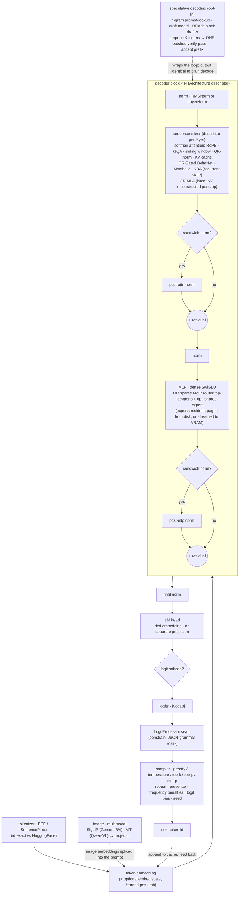
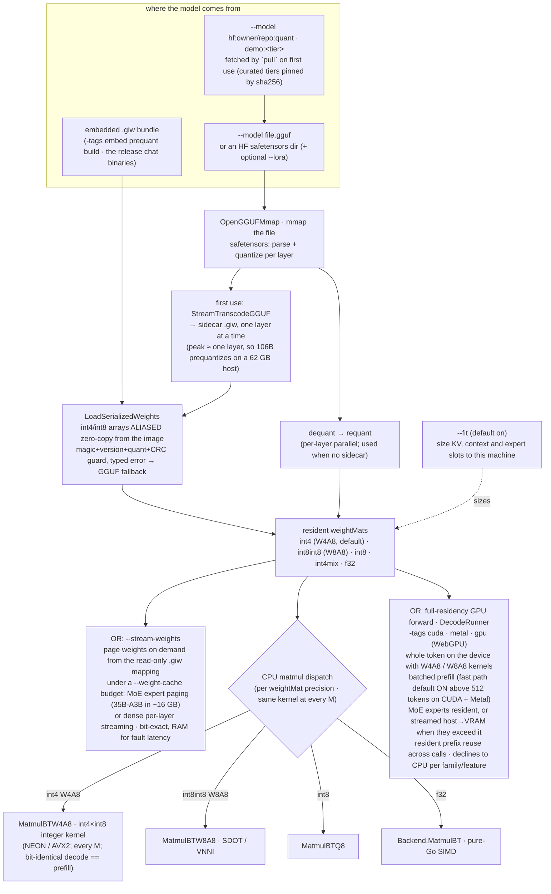
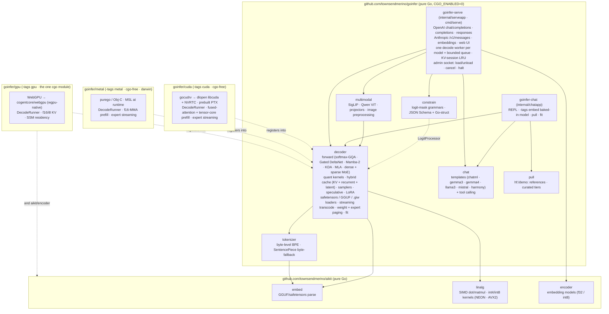

# goinfer architecture

A tour of how goinfer turns a prompt into tokens, and how a model gets from a
file (or the binary's own image) into RAM and onto a GPU. Three diagrams: the
**forward pass**, the **load + memory paths**, and the **module map**.

> **Rewritten 2026-09-12** against `main` at `972bd2d` (v0.17.2). The previous text dated
> from the v0.5–v0.7 era and described one GPU backend, an int8 default and a dozen
> families; the diagrams below are redrawn for three backends, the int4 default and the
> 36-family registry. **What runs where is not restated here** — `capability-matrix.md`
> (families, generated from the `decoder` registry) and `hardware-matrix.md` (per-backend
> residency, generated from `decoder.ResidentEligible`) are the truth and regenerate with
> the code; this page explains the shapes those tables are made of.

> These diagrams are intentionally drawn at the *stage* level, not the
> struct-field level. goinfer is descriptor-driven — one generic decoder runs every
> family in the **softmax-GQA** class (26 of the 36 families: Qwen 2/2.5/3, Llama,
> Mistral/Ministral, Gemma 3, Phi, Mellum, SmolLM3, OLMo 3, Cohere, InternLM2, GPT-2,
> the VL variants, and the standard sparse-MoE families — Mixtral, Qwen-MoE, GLM-4.5/4.6,
> Granite 4.2) by reading an `Architecture` descriptor — so the per-model specifics
> (which norm, GQA ratio, RoPE scaling, sliding window, QK-norm, tied vs separate head,
> **MoE routing variant**) are *config*, not separate code paths. Even the sparse-MoE FFN is
> mostly config: a router scores experts, the top-k run as gated MLPs, plus an optional
> always-on shared expert — one `moeMLP` covers softmax top-k (Mixtral), sigmoid-gated
> shared (Qwen-MoE), DeepSeek sigmoid routing with an `e_score_correction_bias` and an
> ungated shared expert (GLM), and fused experts (Granite). Drawing stages keeps these
> accurate across new families; the numeric contract is the parity gate against
> HuggingFace, not this doc.
>
> **The exceptions to "config, not code paths"** are the families that add a new
> *sequence-mixing primitive* — descriptor-selected per layer, running over a hybrid
> cache (KV for the softmax layers + a per-layer recurrent or latent state). The
> registry groups them into four classes beside softmax-GQA:
>
> - **Gated DeltaNet hybrids** (`qwen3_5_moe` → Qwen 3.5/3.6-MoE, Qwen3.8 dense,
>   Qwen3-Next; `olmo_hybrid`): most layers are **Gated DeltaNet** (linear attention with a
>   recurrent matrix state) — `deltanet.go` / `deltanet_chunked.go`, state `deltaState`,
>   forward `forward_qwen35.go`.
> - **Latent-KV / MLA** (`deepseek_v2`, `deepseek_v3`, Kimi K2, Ling 3.0): **Multi-head
>   Latent Attention** — K/V compress to a shared low-rank latent (`kv_lora_rank`) which is
>   the ONLY thing cached (`KVCache.mlaLatent`, beside full-KV and recurrent state); per-head
>   K/V are reconstructed each step, with decoupled RoPE on a separate slice —
>   `forward_deepseek.go`. Ling 3.0 (`bailing_hybrid`) alternates MLA with **Kimi Delta
>   Attention** (per-channel-decay delta rule) — `kda.go`, state `kdaState`,
>   `forward_bailing.go`.
> - **Mamba-2 state-space hybrids**: **Granite-4.0-H** (`granitemoehybrid`: Mamba-2 layers +
>   softmax attention, MoE on every layer, four Granite scalar multipliers) and
>   **Nemotron-H** (`nemotron_h`: single-op-per-block Mamba-2 / NoPE-GQA / squared-ReLU MLP)
>   — `mamba2.go` (sequential scan + an equivalent chunked scan), state `mamba2State`
>   (`{conv window, SSM state}`), `forward_granite.go` / `forward_nemotron.go`.
> - Within softmax-GQA, a few families still carry their own layer loop for a non-mixer
>   reason: **LFM2** (short-conv layers, `forward_lfm2.go`), **Gemma 4** (per-layer attention
>   shapes and the MoE variant, `forward_gemma4*.go`), **gpt-oss** (`forward_gptoss.go`),
>   **Llama 4** (`forward_llama4.go`).
>
> `decoder/arch.go`'s `ownForwards` table is THE list of own-forward families, and every
> consumer that must exclude them — CPU batched prefill (`canBatchN`), speculative
> rollback (`specRollbackSafe`), resident prefix reuse — derives its exclusion from that
> table rather than restating it. (It used to be restated; the copy fell one family behind
> and a 2-token LFM2 prompt panicked — audit 2026-09-02 C-01.) Recurrent state is mutated
> in place per token, so those families refuse rollback-based speculative decoding and
> positional prefix reuse until a checkpoint/restore path exists.

## 1. The forward pass (one decode step)

Each generated token runs the full stack once. Prefill runs the prompt through the same
layers — as one batched `M=K` pass where the family and backend allow it, sequentially
otherwise — filling the KV cache and keeping logits only for the last position.



The **`LogitProcessor` seam** is where `constrain` lives: it masks each step's logits
*before* sampling, so a JSON grammar makes malformed output literally unreachable —
independent of model size.

**Speculative decoding** wraps the loop rather than changing it: a drafter proposes a
block of K tokens, the target verifies them in one batched forward, and the accepted
prefix is emitted. Three drafters ship — lossless **n-gram** prompt-lookup (`--spec
ngram`, wins on copy-heavy traffic), a smaller **draft model** (`--draft`), and a
pretrained **DFlash block drafter** (`--drafter`) — with EAGLE and MTP heads in-tree behind
the `docs/spec/` gates. Greedy output is bit-identical to plain decode; sampled output is
in-distribution. The batched verify is the same `M=K` machinery prefill uses.

**Multimodal** is vision-in only: `multimodal` runs the vision tower (SigLIP for Gemma
3/4, the ViT + dynamic-resolution preprocessing for Qwen2.5-VL / Qwen3-VL) and projector,
and the resulting embeddings are spliced into the prompt at the image placeholders; the
text decoder is unchanged. Image turns are hashed so resident prefix reuse survives them.

## 2. Load + memory paths

The same resident weight set can be reached several ways. The differences are purely
*where the bytes come from* and *how much RAM they cost* — the forward pass above is
identical afterward, and quantization is fixed at load.



**Why the `.giw` path is the headline.** It skips decompress **and** dequant/requant
**and** the resident-weight heap copy — quantized weights are mapped straight from the
binary's read-only image (or the sidecar file). The RAM win scales with model size, which
is what lets the release chat binaries ship a **baked-in model in two tiers** (Qwen2.5-Coder
0.5B and 1.5B, `-tags embed`) from one program, and what makes a bigger-than-RAM model
runnable at all: the same mapping is the substrate `--stream-weights` pages from. A plain
`.gguf` is transcoded to a sidecar `.giw` on first use, and that transcode is itself
streaming, so the file that gets prequantized never has to fit in RAM. Any bundle mismatch
(magic / version / quant / CRC) is a typed error, never a panic, and the loader falls back
to the GGUF path.

The v0.5.0-era measurement that established this, kept as the record (Qwen2.5-Coder-0.5B,
M1 Pro, prequant int8 — **current numbers are in `benchmarks.md` §A**, and decode is roughly
1.5× these after the 2026-08 CPU campaign):

| metric | embedded GGUF | prequant `.giw` | win |
|---|---|---|---|
| cold start | 2.30 s | 0.48 s | ~5× |
| resident heap (`phys_footprint`) | 772 MB | 78 MB | ~10× |
| binary size | 475 MB | 617 MB | +30% |

The 1.5B tier had ~3× the weights but near-identical resident heap (77 → 87 MB) — the
weights are image-mapped, not heap-copied.

**Quantization.** `int4` (W4A8: int4 weights, int8 activations) is the default on every
backend, chosen by measurement; `int8int8` (W8A8) where accuracy matters more than RAM;
`int8` (weight-only), `int4mix` (attention int8 + FFN int4, GGUF only) and native `f32` as
the reference. `quantization.md` has the per-precision numbers and the caveats. The CPU
kernels are integer SIMD (NEON on arm64, AVX2 on amd64, hand-written `.s`) and are the same
kernel at every `M`, which is what makes decode and prefill bit-identical on the CPU path.
The `.giw` carries its quant; the runtime `--quant` flag applies only to the `--model` path.

**Fit.** `--fit` (default on) sizes what the flags leave unpinned — KV capacity, context,
expert slots, whether a drafter fits — from what the machine actually has, and refuses a
load that would not fit rather than swapping (`task-fit-to-hardware.md`). `--fit=off`
restores the flat historical defaults.

**Running bigger than RAM (`--stream-weights`).** Weights are paged on demand out of the
read-only `.giw` mapping under a RAM budget (`--weight-cache`) instead of all held
resident — MoE expert demand-paging (a 35B-A3B in ~16 GB) or dense per-layer streaming.
Bit-exact (a read-only re-fault), trading RAM for cold-miss fault latency. The expert pager
is one global LRU across layers, keyed by span, with `madvise` hints so the kernel prefetches
what the router is about to ask for.

**The GPU backends.** Three, each a separate module (§3), each running the *entire token
forward* on the device through `DecodeRunner` with quantized kernels (`W4A8`, `W8A8`):

- **CUDA** (`-tags cuda`) — cgo-free: `gocudrv` dlopens `libcuda` and NVRTC at runtime;
  kernels ship as prebuilt PTX with NVRTC as the fallback compiler. Batched prefill with
  a fused attention kernel and a tensor-core int4 GEMM, **default ON above a 512-token
  prompt** (the §3 fidelity gate, `task-prefill-gap.md`; `GOINFER_CUDA_FAST_PREFILL=0` opts
  out). MoE experts resident, or **streamed host→VRAM per token** when they exceed VRAM
  (`-moe-cache-experts`) — a 26B MoE runs on an 8 GB card that way.
- **Metal** (`-tags metal`, darwin) — cgo-free: `purego` + Obj-C runtime, MSL compiled at
  runtime. f16-MMA batched prefill, default ON above 512 tokens. Expert streaming for the
  Gemma 4 MoE.
- **WebGPU** (`-tags gpu`) — the original backend and **the one cgo dependency**
  (`cogentcore/webgpu` → wgpu-native). Also the widest per-family coverage for the
  SSM hybrids (Nemotron-H is resident here and CPU on CUDA/Metal, `FeatSSM`). KV cache
  `f32` (bit-exact, 16k ctx) / `f16` (32k) / `i8` (~64k) via `-kv`.

Every backend **declines to the CPU path per family and per feature** rather than running
something it does not implement: `decoder.ResidentEligible` reads the arch flags plus the
shared feature taxonomy, and `hardware-matrix.md` is generated from it. **Resident prefix
reuse** (a continuing chat or agent loop prefills only the new suffix on the device) works
on all three; it is adapter-aware and excludes the recurrent families. The Mamba-2 decode
engine that brought the SSM hybrids onto a GPU is the reframe *decode is a bounded
per-token recurrence, not the prefill scan* — `docs/completed/decode-residency-campaign.md`,
`gpu-residency-coverage.md`.

## 3. Module map (and where cgo is quarantined)

goinfer is the LLM-runtime half; the tensor and embedding primitives live in `aikit`. On
top of `decoder` sit `tokenizer`, `chat` (per-family chat templates + tool calling),
`constrain` (schema-constrained decoding), `multimodal` (vision towers + projectors) and
`pull` (curated model references), and on top of those the two binaries: `goinfer-chat`
(`internal/chatapp` — one binary, no daemon, optionally with the model baked in) and
`goinfer-serve` (`internal/serveapp` behind `cmd/serve`). Everything in the default build
is pure Go, `CGO_ENABLED=0`. The one cgo dependency (`cogentcore/webgpu`) is sealed inside
the opt-in `goinfer/gpu` submodule; the CUDA and Metal backends are cgo-free by construction
(dlopen / purego).



The arrows into the backends are dashed because the dependency is *inverted*: each backend
imports `decoder` and registers into it on init, so no GPU library ever enters the core
module graph. The default `go build` pulls only `aikit` + `golang.org/x/text`. A browser /
WASM backend (`GOOS=js` → `navigator.gpu`, cgo-free) is a demo on the roadmap, not a
binding strategy — see `roadmap.md`.

**The serving shape** matters for reading the rest of the docs: `serve` runs **one
generation at a time per model** behind a bounded queue (`--max-queue`) — no continuous
batching, no paged attention, by decision (`positioning.md`, `roadmap.md`). Cross-call KV
reuse is a prefix-keyed session LRU (`--kv-sessions`, with optional tiered demotion to
`--session-dir`), which is what makes an agent loop cheap. Control — load/unload, cancel by
id, global halt — lives on a separate admin channel (`--admin-socket`), never on the `/v1`
listener (`task-halt-2026-09.md`). `task-work-queue-2026-09.md` scopes jobs and batch APIs on
top of this shape without changing it.

## The contract

Numerics — the forward pass and quantization — are **parity-gated against HuggingFace** and
are the stable surface: every family carries its strongest validation in
`testdata/parity_manifest.json` (surfaced as the Parity column of `capability-matrix.md`),
`what-parity-gated-means.md` says what that does and does not cover, and `cmd/gate` is the
runner that keeps the ledger. The loader and the `Architecture` descriptor move as new
families and quant formats land, and **v1.0 will not freeze them**: `api-tiers.md` (signed
off 2026-08-18) names the descriptor, the loader internals and the residency seam as
Experimental *explicitly*, so "still moving" is a stated exclusion rather than an unstated
risk. That is also why the `.giw` format carries a version guard (a stale bundle triggers a
safe rebuild via the GGUF path, never a crash).

## Modules and packages

Moved here from the README (2026-08-27) so the front page stays short.

### Modules

goinfer ships as **five Go modules**. The three GPU backends are separate modules so their
dependencies (`cogentcore/webgpu` and its cgo, `eitamring/gocudrv`, `ebitengine/purego`) never
enter the dependency graph of a build that doesn't ask for them, and `demo/agent` is separate for
the same reason — it keeps the MCP SDK out of the root's dependency-light `go.mod`.

| Module path | Contents |
|---|---|
| `github.com/townsendmerino/goinfer` | everything in the Packages table below except the three backends |
| `github.com/townsendmerino/goinfer/gpu` | WebGPU backend (`-tags gpu`) |
| `github.com/townsendmerino/goinfer/cuda` | native CUDA backend (`-tags cuda`) |
| `github.com/townsendmerino/goinfer/metal` | native Metal backend (`-tags metal`) |
| `github.com/townsendmerino/goinfer/demo/agent` | the local RAG coding agent — separate so the MCP SDK stays out of the root |

**Four of the five are the ones you build against**; `demo/agent` is a demo, not a surface, and is
not covered by `docs/api-tiers.md`. It is listed here because `go.work` and the release ritual both
treat it as a module — `RELEASING.md` tags five, and a cross-module change that forgets it fails
there rather than here.

**You normally name only the root**, because the root alone is all a pure-Go build needs. Since
the M-19 split its `go.mod` requires NONE of the backend modules — `go get
github.com/townsendmerino/goinfer` brings the root only, and a `-tags cuda` build needs the cuda
module named explicitly. (N-39/N-38: this used to say the root "requires the other three … so a
`-tags cuda` build resolves without further action", which stopped being true when the requires
were removed.) Name a backend module to build against it, or to pin, vendor, or audit it:

```bash
go get github.com/townsendmerino/goinfer/cuda@latest
```

**The backend modules are versioned independently of the root and of each other** — they are
not in lockstep, since a root-only release doesn't retag them. Backend tags carry the module
path as a prefix (`gpu/vX.Y.Z`, `cuda/vX.Y.Z`, `metal/vX.Y.Z`), which is how Go's module proxy
resolves a submodule tag; the bare `vX.Y.Z` tags are the root's. Check the
[releases page](https://github.com/townsendmerino/goinfer/releases) for what is current — and
when in doubt, take the root's requirement rather than picking a backend version yourself.

## Packages

| Package | Purpose | Deps beyond stdlib |
|---|---|---|
| `decoder` | generic decoder-only forward pass across five mixer classes; f32/bf16/f16 + int8/int4 (W4A8, W8A8); safetensors/GGUF/GPTQ/AWQ/`.giw`; hybrid cache (KV, recurrent, latent); samplers; speculative decoding; LoRA; weight + expert paging; fit | `aikit/embed`, `aikit/linalg`, `goinfer/tokenizer` |
| `tokenizer` | BPE tokenizers the decoder LLMs ship — byte-level + SentencePiece byte-fallback, from `tokenizer.json` or a bare `.gguf`; HF-exact id parity | `aikit/embed`, `golang.org/x/text` |
| `constrain` | constrained / structured decoding — a logit mask that forces output to satisfy a grammar; streaming JSON grammar + JSON Schema (and Go-struct) compiler | — |
| `chat` | chat-template detection + byte-exact native renderers (`chatml`, `gemma3`, `gemma4`, `llama3`, `mistral`, `harmony`) and per-family tool calling (render + parse) | — |
| `multimodal` | vision towers and projectors — SigLIP (Gemma 3/4), Qwen2.5-VL / Qwen3-VL ViT with dynamic-resolution preprocessing; image hashing for prefix reuse | `goinfer/decoder` |
| `pull` | the curated model tiers (`demo:<tier>`, pinned by sha256) and `hf:owner/repo:quant` reference resolution the binaries fetch on first use | — |
| `internal/chatapp`, `internal/serveapp` | the two binaries — `goinfer-chat` (REPL, `-tags embed`, `pull`, `fit`) and `goinfer-serve` (OpenAI + Anthropic HTTP, embeddings, sessions, admin) | the packages above; `aikit/encoder` (serve embeddings) |
| `cmd/gate`, `cmd/prequant` | the parity/gate runner that keeps the ledger; the `.giw` builder | — |
| `gpu` (opt-in, `-tags gpu`) | WebGPU full-residency backend (Metal / Vulkan / DX12 via wgpu-native) | `cogentcore/webgpu` (cgo), `aikit/encoder`, `goinfer/decoder` |
| `cuda` (opt-in, `-tags cuda`) | cgo-free native CUDA backend — dlopen libcuda + NVRTC, prebuilt PTX, dense + MoE residency with expert streaming, batched prefill, `CGO_ENABLED=0` | `eitamring/gocudrv`, `goinfer/decoder` |
| `metal` (opt-in, `-tags metal`) | cgo-free native Metal backend — purego / Obj-C, MSL compiled at runtime, dense + MoE residency with expert streaming, batched prefill, darwin, `CGO_ENABLED=0` | `ebitengine/purego`, `goinfer/decoder` |

The cgo WebGPU dependency is confined to the `gpu` submodule; the two native GPU
backends (`cuda`, `metal`) are **cgo-free**. Either way the default build is pure Go,
no cgo — a backend is compiled only when you pass its build tag.
