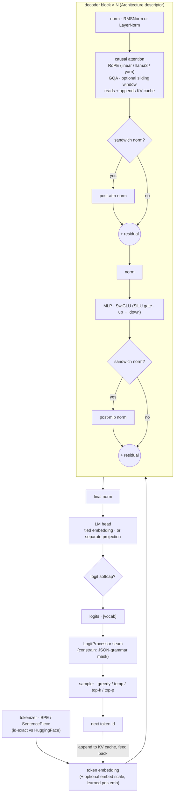
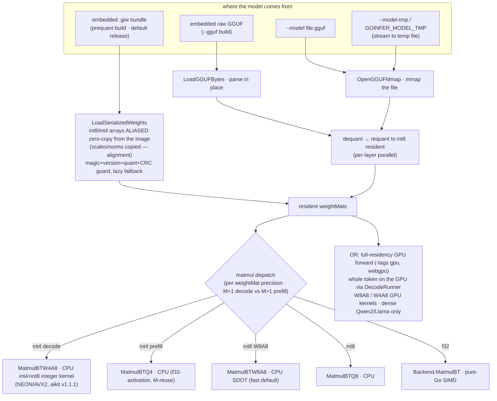
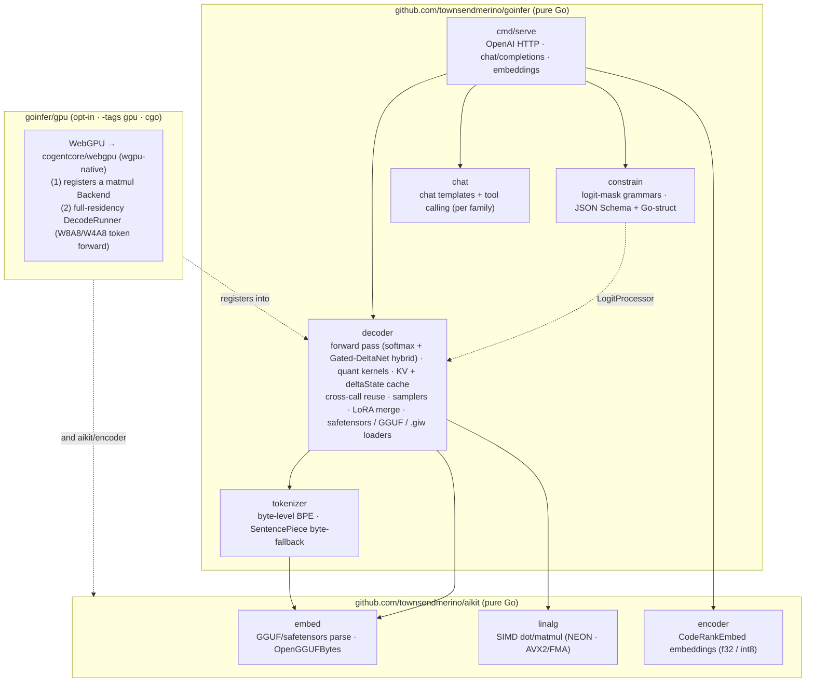

# goinfer architecture

A tour of how goinfer turns a prompt into tokens, and how the model gets from a
file (or the binary's own image) into RAM. Three diagrams: the **forward pass**,
the **load + memory paths**, and the **module map**.

> These diagrams are intentionally drawn at the *stage* level, not the
> struct-field level. goinfer is descriptor-driven — one generic decoder runs
> Gemma 3/4, Qwen 2.5/3, Llama, Mistral, Mixtral, GPT-2, Mellum/Mellum2 by reading
> an `Architecture` descriptor — so the per-model specifics (which norm, GQA ratio,
> RoPE scaling, tied vs separate head) are *config*, not separate code paths.
> Drawing stages keeps these accurate across new model families; the numeric
> contract is the parity gate against HuggingFace, not this doc.
>
> **One exception to "config, not code paths":** the hybrid linear/softmax MoE
> family (Qwen 3.6 / `qwen3_5_moe`) adds a genuinely new sequence-mixing
> primitive — most layers are **Gated DeltaNet** (linear attention with a
> recurrent matrix state) rather than softmax attention, with a hybrid cache
> (KV for the softmax layers + a per-layer `deltaState`). That's a second forward
> primitive (`deltanet.go`), descriptor-selected per layer, not just a config knob.

## 1. The forward pass (one decode step)

Each generated token runs the full stack once. Prefill runs the prompt tokens
through the same path (filling the KV cache) and only keeps logits for the last.

The **`LogitProcessor` seam** is where `constrain` lives: it masks each step's
logits *before* sampling, so a JSON grammar makes malformed output literally
unreachable — independent of model size.

## 2. Load + memory paths

The same resident weight bundle can be reached four ways. The differences are
purely *where the bytes come from* and *how much heap they cost* — the forward
pass above is identical afterward.

Why the `.giw` path is the headline: it skips decompress **and** dequant/requant
**and** the resident-weight heap copy — the int8 weights are mapped straight from
the binary's read-only image. Measured on Qwen2.5-Coder-0.5B (M-series CPU):

| metric | embedded GGUF | prequant `.giw` | win |
|---|---|---|---|
| cold start | 2.30 s | 0.48 s | ~5× |
| resident heap (`phys_footprint`) | 772 MB | 78 MB | ~10× |
| binary size | 475 MB | 617 MB | +30% |

The RAM win scales with model size, which is what lets the demo ship in **two
size tiers** from one program (prequant `.giw`, M-series CPU, fixed prompt+seed):

| tier | binary | cold start | resident heap | tok/s (demo) |
|---|---|---|---|---|
| Qwen2.5-Coder-0.5B | 617 MB | 0.48 s | 77 MB | ~57 |
| Qwen2.5-Coder-1.5B | 1.72 GB | 1.23 s | 87 MB | ~26 |

(End-to-end demo tok/s, M1 Pro, after the v0.5.0 perf work — see
`docs/perf-campaign.md`. Pure runtime decode is higher: ~70 / ~36 tok/s on
`BenchmarkDecode`; the gap is streaming/UI overhead. ±a few tok/s by thermal
state.)

The 1.5B has ~3× the weights but **near-identical resident heap** (77 → 87 MB) —
they're image-mapped, not heap-copied — and stays under GitHub's 2 GiB asset cap.
Without prequant the 1.5B would need a ~1.7 GB weight heap per launch; that's the
enabler. (Looking further, a 4B int8 model no longer needs a ~5 GB weight heap,
which is what makes a `FROM scratch` container demo viable.) Quant is fixed when
the `.giw` is built; the runtime `--quant` flag and
the GGUF fallback apply only to the `--model <gguf>` path. Any bundle
mismatch (magic / version / quant / CRC) returns a typed error — never a panic —
and the user falls back via `--model`.

**Two GPU modes (`-tags gpu`, WebGPU).** (1) A per-matmul `Backend` that
substitutes for the f32 kernel — the original, arch-agnostic path. (2) **Full
residency** (v0.4.0): for dense Qwen2/Llama the *entire token forward* runs on
the GPU through `DecodeRunner`, with **quantized** GPU kernels — `W8A8` (int8)
and `W4A8` (int4). This is the headline: a **7B int4 fits and decodes pure-GPU on
an 8 GB card** (~51 tok/s, ~71% of llama.cpp-CUDA at equal 4-bit quant) — the
model class that does *not* fit at int8. v1 residency limits: stateless
`Generate` only (Session/prefix-reuse fall back to the staged path), 16k context
(f32 KV), dense Qwen2/Llama only (MoE / Gemma / hybrid → staged). Full numbers:
`docs/gpu-assessment.md`.

## 3. Module map (and where cgo is quarantined)

goinfer is the LLM-runtime half; the tensor/embedding primitives live in
`aikit`. On top of the `decoder` sit `chat` (per-family chat templates + tool
calling), `constrain` (schema-constrained decoding), and `cmd/serve` — an
OpenAI-compatible HTTP server for generation (chat/completions, with cross-call
KV reuse) and, via aikit's `encoder`, embeddings. Everything in the default
build is pure Go, no cgo. The one cgo dependency (`cogentcore/webgpu`) is sealed
inside the opt-in `goinfer/gpu` submodule, built only under `-tags gpu`.

The arrows into `gpu` are dashed because the dependency is *inverted*: `gpu`
imports `decoder`/`encoder` and registers into them on init, so `webgpu` never
enters the core module graph. The default `go build` pulls only `aikit` +
`golang.org/x/text` — pure Go, no cgo. (Native GPU is cgo via wgpu-native; a
future browser/wasm backend would reach `navigator.gpu` through `syscall/js`,
cgo-free — see `docs/roadmap.md`.)

## The contract

Numerics — the forward pass and quantization — are **parity-gated against
HuggingFace** and are the stable surface. The loader and `Architecture`
descriptor are pre-1.0 and move as new model families and quant formats land;
that's why the `.giw` format carries a version guard (a stale bundle triggers a
safe rebuild via the GGUF path, never a crash).
