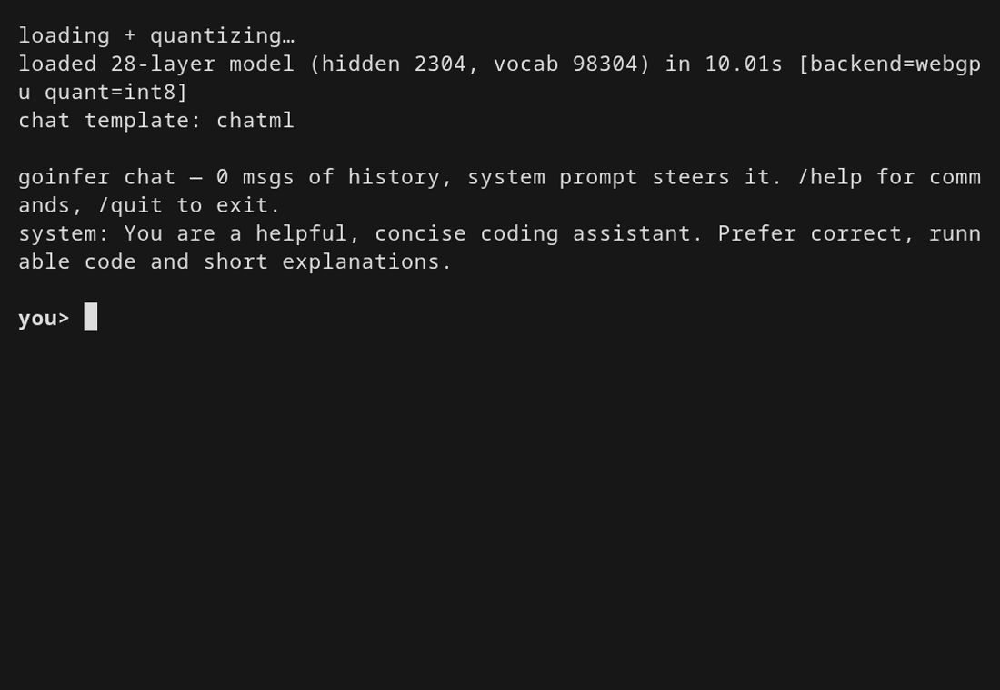

# goinfer v0.8.0

A pure-Go (no-cgo) LLM runtime. This release takes the **GPU resident-decode path** from
"dense Qwen2/Llama only" to **most served families** — MoE, MLA latent-attention, and
Mamba-2 hybrids all decode on-device now — and makes a **12B coding MoE run GPU-resident on
a consumer 8 GB card**. Forward-pass numerics stay parity-gated against HuggingFace.

## Highlights

### 🚀 Resident GPU decode for most mainstream families
The on-GPU full-token decode path (`DecodeRunner`) used to require a dense Qwen2/Llama
shape. A ladder of bounded eligibility widenings — reusing existing kernels — opened it to:
- **MoE**: Mixtral / Qwen2-MoE / **GLM-4.5/4.6** (partial-RoPE) and **DeepSeek-V2/V3 + Kimi-K2**
  via a new **MLA latent-attention** residency bridge (rank-space attention, latent-KV store,
  per-head absorb/lift kernels).
- **Mistral** (sliding-window residency) and **Mellum** (per-layer-RoPE residency).

Most served models now decode pure-GPU instead of the staged per-matmul path (~3× the
per-token speed where it applies). The honest ceiling is unchanged — ~60–70% of
llama.cpp/Ollama-CUDA at equal 4-bit quant, a portable WebGPU backend vs years-tuned CUDA.
*(Peer figure as measured for v0.8.0 (~2026-06) on the WebGPU backend; the cgo-free CUDA
backend and the Ollama v0.32.5 re-anchor in `docs/benchmarks.md` §B2 supersede it.)*

### 🧬 A resident Mamba-2 SSM decode engine (hybrids go on-GPU)
The reframe: *decode is a bounded per-token recurrence, not the prefill scan* — so Mamba-2
state slots onto the `DecodeRunner` like a KV cache (`mambaConv`/`mambaSSM`/`mambaGatedNorm`
kernels, build-once persistent conv-ring + ssm state).
- **Nemotron-H** — resident, **default-on at int4**. Near-lossless (perplexity 1.677 vs f32
  1.695, KL 0.058; the ~7.5% greedy disagreements are 100% benign — 99.6% top-2 agreement,
  every divergence at a near-tie), ~13× the f32 CPU path.
- **Granite-4.0-H** — resident, **opt-in** (`GOINFER_SSM_RESIDENT`): a 10× greedy speedup,
  but int8-quality-limited (its 64-expert router turns f32-reduction-order noise into discrete
  expert-flips — a *fundamental* cliff, not a bug; Nemotron, having no router, doesn't hit it).

### ⚡ Mellum2: a 12B coding MoE, GPU-resident on an 8 GB card — and it loads fast


A 12B model that won't fit 8 GB at int8 runs **fully resident at int4** (~13–21 tok/s, pure
Go via WebGPU — no CUDA, no Python). And the cold-start tax is mostly gone:
- **Prequant any safetensors model to an int4 `.giw`** — `cmd/prequant` now takes a
  safetensors directory, not just a GGUF.
- **Direct int4 resident upload** — the decoder's int4 storage turns out to be *byte-identical*
  to the GPU packed layout (K%32==0), so the resident upload skips a ~30 s per-launch
  unpack+repack and `CreateBufferInit`s the bytes straight.
- Net: Mellum2's int4 resident load **~66 s → ~13 s** (warm). Benefits every int4 resident
  load. Token-identical decode, gated by `gpu.TestGIWInt4_resident`.

### 🛠️ Fixes & internals
- **GGUF→`.giw` rope fix** — nil `json.RawMessage` config fields marshalled to `null` and
  re-fired "present" checks on reload, breaking GGUF→`.giw` for MLA/YaRN families. `,omitempty`
  fixes the round-trip.
- **`int4mix` label** — a mixed bundle (int4 experts + int8 embed/head) now reports `int4mix`,
  not `int8` (`.giw` format tag untouched — existing bundles still load).
- **Decode kernel fusion** — q-rope + k-rope-store + v-store fused into one dispatch (+1.5%);
  q/k/v bias folded into the GEMV epilogue (+2.3% real Qwen2.5).
- **Parity manifest**: `serialize.go` split into its own deps set so serialize-only edits don't
  re-stale forward-parity rows; a policy guardrail forbids re-hashing a forward/core-changed
  validated family without re-running its gate.
- The mmap/madvise/span-residency weight substrate moved to `aikit/mmap`.

## Notes
- **Parity:** all six oracle-validated families were re-confirmed at the release commit.
  deepseek_v2/v3 re-ran to argmax 100% / cosine 0.999 (the MLA `kv_b_proj` absorb is
  numerically intact). qwen3_5_moe's int8-vs-bf16 Gate-2 moved slightly under the
  `forward_qwen35.go` refactors (74/80 → 66/80, cosine_min 0.99466 → 0.99333) but stays above
  its enforced floor (cosine_min ≥ 0.98, every divergence a near-tie; mean ~unchanged 0.99837)
  — documented, not silent (CHANGELOG → Findings). The 14 not-yet-oracle-validated families
  ship **experimental** and show `pending` in the capability matrix (full validation is the 1.0
  gate).
- **Upgrade heads-up:** the `int4mix` label change alters the `.giw-kv` warm-snapshot
  fingerprint for **mixed-precision bundles** → a one-time cold prefill on first run after
  upgrade (per-version caches, expected).

## Verify
```
go test ./...                              # parity, matrix freshness, coverage — all green
go list -m github.com/townsendmerino/goinfer@v0.8.0
```

Full detail: [CHANGELOG.md](../../CHANGELOG.md) (`[v0.8.0]`). Capability matrix + measured
numbers with provenance: [docs/benchmarks.md](../benchmarks.md), [docs/capability-matrix.md](../capability-matrix.md).
